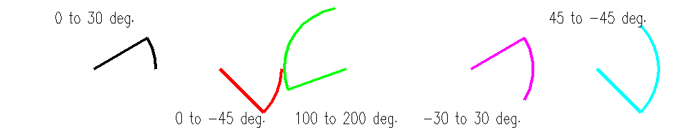

<?
<body>
  
  

    

      

      

      <h3><a name="0">NAME</a></h3>
      <blockquote>
        <b>arc(3f)</b> - [M_draw:ARCS] Draw an arc in world units. <b></b>
      </blockquote>
      <h3><a name="5">SYNOPSIS</a></h3>
      <blockquote>
        <pre>
subroutine <b>arc</b>(<i>x</i>, <i>y</i>, <i>radius</i>, <i>startang</i>, <i>endang</i>)
<b>real,intent</b>(<i>in</i>) :: <i>x</i>
<b>real,intent</b>(<i>in</i>) :: <i>y</i>
<b>real,intent</b>(<i>in</i>) :: <i>radius</i>
<b>real,intent</b>(<i>in</i>) :: <i>startang</i>
<b>real,intent</b>(<i>in</i>) :: <i>endang</i>
</pre>
      </blockquote>
      <h3><a name="2">DESCRIPTION</a></h3>
      <blockquote>
        
Draw an arc. <i>x</i>, <i>y</i>, and <i>radius</i> are values <i>in</i> world units

        <table cellpadding="3">
          <!-- tsb: Draw an arc. <I>x</I>, <I>y</I>, and <I>radius</I> are values <I>in</I> world units
 -->
          <tr valign="top">
            <td class="c9" width="6%" nowrap="nowrap">using</td>
            <td valign="bottom">current line width and color</td>
          </tr>
        </table>Angles are <i>in</i> degrees, positive measured counterclockwise from the +X axis. The current position after the arc is drawn is at the end
        of the arc.
      </blockquote>
      <h3><a name="3">OPTIONS</a></h3>
      <blockquote>
        <table cellpadding="3">
          <tr valign="top">
            <td class="c9" width="6%" nowrap="nowrap">X,Y</td>
            <td valign="bottom">Coordinates for the center of the circle</td>
          </tr>
          <tr valign="top">
            <td class="c9" width="6%" nowrap="nowrap">RADIUS</td>
            <td valign="bottom">Radius of the circle</td>
          </tr>
          <tr valign="top">
            <td class="c9" colspan="1">STARTANG</td>
            <td>Start angle</td>
          </tr>
          <tr valign="top">
            <td class="c9" width="6%" nowrap="nowrap">ENDANG</td>
            <td valign="bottom">End angle</td>
          </tr>
        </table>
      </blockquote>
      <h3><a name="4">EXAMPLE</a></h3>
      <blockquote>
        Sample program:
        <pre>
   program demo_arc
      use M_draw
      use M_draw,    only  : D_BLACK,   D_WHITE
      use M_draw,    only  : D_RED,     D_GREEN,    D_BLUE
      use M_draw,    only  : D_YELLOW,  D_MAGENTA,  D_CYAN
      implicit none
      integer        :: icolor
      real           :: b=0.5
      real           :: R=4.9
      real           :: X, Y, A, YY
      integer        :: key
      call prefsize(1000,200)
      call vinit(' ')
      call color(D_BLACK)
      call clear()
      call color(D_YELLOW)
      call page(-25.0-b, 25.0+b, -5.0-b, 5.0+b)
      call textsize(1.0,1.4)
      call font("futura.l")
      call centertext(.true.)
      ! draw arcs with various start and end angles
       X=-20.0; Y=0.0; A=0.0; B=30.0;  icolor=7; YY=4
      call drawit("0 to 30 deg.")
       X=-10.0; YY=-4; A=0.0; B=-45.0; icolor=1
      call drawit("0 to -45 deg.")
       X=0.0; YY=-4; A=100.0; B=200.0; icolor=2
      call drawit("100 to 200 deg.")
       X=10.0; YY=-4; A=-30.0; B=30.0;icolor=5
      call drawit("-30 to 30 deg.")
       YY=4; X=20.0; A=45.0; B=-45.0; icolor=6
      call drawit("45 to -45 deg.")
       call vflush()
      key=getkey()
      call vexit()
   contains
      subroutine drawit(label)
         character(len=*) :: label
         call linewidth(150)
         call color(icolor)
         call arc(X,Y,R,A,B)
         call draw2(X,Y)
         call move2(X,YY)
         call linewidth(50)
         call color(D_WHITE)
         call drawstr(label)
      end subroutine drawit
    end program demo_arc
 
</pre>
      </blockquote>
      

       
      

    

  

</body>
