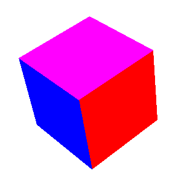

<?
<body>
  
  

    

      

      

      <h3><a name="0">NAME</a></h3>
      <blockquote>
        <b>backface(3f)</b> - [M_draw:POLYGONS] Turns on culling of backfacing polygons. <b></b>
      </blockquote>
      <h3><a name="4">SYNOPSIS</a></h3>
      <blockquote>
        <pre>
subroutine <b>backface</b>(<i>onoff</i>)
logical <i>onoff</i>
</pre>
      </blockquote>
      <h3><a name="2">DESCRIPTION</a></h3>
      <blockquote>
        Turns on culling of backfacing polygons. A polygon is backfacing if its orientation in *screen* coords is clockwise, unless a call to backfacedir is
        made.
      </blockquote>
      <h3><a name="3">EXAMPLE</a></h3>
      <blockquote>
        Sample program:
        <pre>
   program demo_backface
   !      demonstrate double buffering and what happens when you hit clipping plane
   !
   !      Specifying an extra argument turns on the filling.
   !
   use M_draw
   character(len=30) :: device
   character(len=1)  :: c
   real    r, t, dr, dt
   integer nplanes
   logical fill, back, backdir
   integer :: ios
    print*,'Enter output device:'
   read(*,'(a)',iostat=ios)device
   if(ios.ne.0)device=' '
    dr = 0.3
   dt = 0.2
   print*,'Enter delta in degrees (0.333 is typical):'
   read(*,*,iostat=ios) dr
   if(ios.ne.0)dr=0.333
   write(*,*)'DR=',dr
    call prefsize(300, 300)
    call vinit(device)
    nplanes = getdepth()
    fill = .true.
   back = .true.
   backdir = .true.
    call polyfill(fill)
   call backface(back)
   call backfacedir(backdir)
    call color(D_BLACK)
   call clear()
    call window(-1.5, 1.5, -1.5, 1.5, 9.0, -5.0)
   call lookat(0.0, 0.0, 12.0, 0.0, 0.0, 0.0, 0.0)
    t = 0.0
   r = 30.0
   !
   ! Setup drawing into the backbuffer....
   !
   if (backbuffer().lt.0) then
      write(*,*)'Device can''t support doublebuffering'
      ! draw a single view so at least the cube is displayed
      call frontbuffer()
      call color(D_BLACK)
      call clear()
      call translate(0.0, 0.0, t)
      call rotate(r, 'y')
      call rotate(r, 'z')
      call rotate(r, 'x')
      call color(D_WHITE)
      call polyfill(.true.)
      call drawcube(nplanes)
      call color(D_BLACK)
      call polyfill(.false.)
      call drawcube(nplanes)
      ipaws=getkey()
      call vexit()
      stop
    endif
    do
      if(r.ge.360) r = 0.0
      call color(D_BLACK)
      call clear()
       call pushmatrix()
       call translate(0.0, 0.0, t)
      call rotate(r, 'y')
      call rotate(r, 'z')
      call rotate(r, 'x')
      call color(D_WHITE)
       call drawcube(nplanes)
       if (nplanes .eq. 1 .and. fill) then
         call polyfill(.false.)
         call color(D_BLACK)
         call drawcube(nplanes)
         call polyfill(fill)
      endif
       call popmatrix()
       t = t + dt
      if (t.gt.3.0 .or. t.lt.-18.0) dt = -dt
       call swapbuffers()
       c = char(checkkey())
      if (c .eq. 'f') then
         fill = .not. fill
         call polyfill(fill)
      elseif (c .eq. 'b') then
         back = .not. back
         call backface(back)
      elseif (c .eq. 'd') then
         backdir = .not. backdir
         call backfacedir(backdir)
      elseif (c .ne. char(0)) then
         call vexit()
         stop
      endif
       r = r + dr
   enddo
    contains
   ! this routine draws the cube, using colours if available
   !
   subroutine drawcube(nplanes)
      integer nplanes
       real carray(3, 8)
      data carray/            &amp;
      &amp;   -1.0,  -1.0,   1.0,  &amp;
      &amp;    1.0,  -1.0,   1.0,  &amp;
      &amp;    1.0,   1.0,   1.0,  &amp;
      &amp;   -1.0,   1.0,   1.0,  &amp;
      &amp;   -1.0,  -1.0,  -1.0,  &amp;
      &amp;    1.0,  -1.0,  -1.0,  &amp;
      &amp;    1.0,   1.0,  -1.0,  &amp;
      &amp;   -1.0,   1.0,  -1.0/
      save carray
       if (nplanes.gt.1) call color(D_RED)
       call makepoly()
      call move(carray(1,1), carray(2,1), carray(3,1))
      call draw(carray(1,2), carray(2,2), carray(3,2))
      call draw(carray(1,3), carray(2,3), carray(3,3))
      call draw(carray(1,4), carray(2,4), carray(3,4))
      call draw(carray(1,1), carray(2,1), carray(3,1))
      call closepoly()
       if (nplanes.gt.1) call color(D_GREEN)
       call makepoly()
      call move(carray(1,6), carray(2,6), carray(3,6))
      call draw(carray(1,5), carray(2,5), carray(3,5))
      call draw(carray(1,8), carray(2,8), carray(3,8))
      call draw(carray(1,7), carray(2,7), carray(3,7))
      call draw(carray(1,6), carray(2,6), carray(3,6))
      call closepoly()
       if (nplanes.gt.1) call color(D_YELLOW)
       call makepoly()
      call move(carray(1,2), carray(2,2), carray(3,2))
      call draw(carray(1,6), carray(2,6), carray(3,6))
      call draw(carray(1,7), carray(2,7), carray(3,7))
      call draw(carray(1,3), carray(2,3), carray(3,3))
      call draw(carray(1,2), carray(2,2), carray(3,2))
      call closepoly()
       if (nplanes.gt.1) call color(D_BLUE)
       call makepoly()
      call move(carray(1,1), carray(2,1), carray(3,1))
      call draw(carray(1,4), carray(2,4), carray(3,4))
      call draw(carray(1,8), carray(2,8), carray(3,8))
      call draw(carray(1,5), carray(2,5), carray(3,5))
      call draw(carray(1,1), carray(2,1), carray(3,1))
      call closepoly()
       if (nplanes.gt.1) call color(D_MAGENTA)
       call makepoly()
      call move(carray(1,3), carray(2,3), carray(3,3))
      call draw(carray(1,7), carray(2,7), carray(3,7))
      call draw(carray(1,8), carray(2,8), carray(3,8))
      call draw(carray(1,4), carray(2,4), carray(3,4))
      call draw(carray(1,3), carray(2,3), carray(3,3))
      call closepoly()
       if (nplanes.gt.1) call color(D_CYAN)
       call makepoly()
      call move(carray(1,1), carray(2,1), carray(3,1))
      call draw(carray(1,5), carray(2,5), carray(3,5))
      call draw(carray(1,6), carray(2,6), carray(3,6))
      call draw(carray(1,2), carray(2,2), carray(3,2))
      call draw(carray(1,1), carray(2,1), carray(3,1))
      call closepoly()
    end subroutine drawcube
    end program demo_backface
 
</pre>
      </blockquote>!
      

       
      

    

  

</body>
