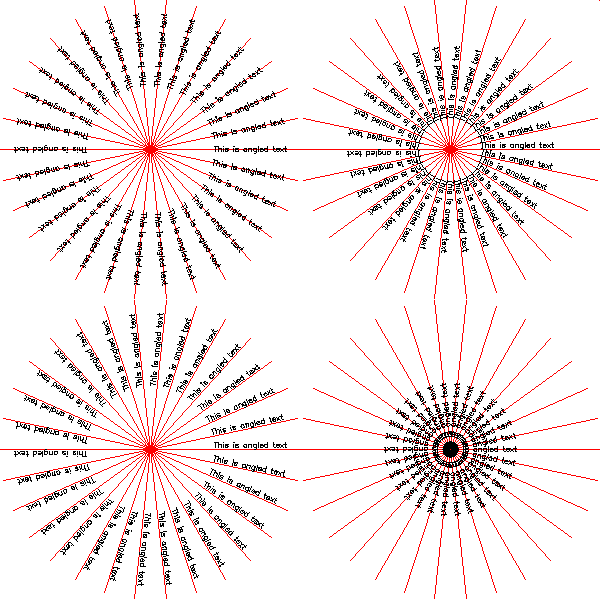

<?
<body>
  
  

    

      

      

      <h3><a name="0">NAME</a></h3>
      <blockquote>
        <b>centertext(3f)</b> - [M_draw:TEXT] Turns centertext mode on or off for SOFTWARE fonts. <b></b>
      </blockquote>
      <h3><a name="5">SYNOPSIS</a></h3>
      <blockquote>
        <pre>
subroutine <b>centertext</b>(<i>onoff</i>)
<b>logical,intent</b>(<i>in</i>) :: <i>onoff</i>
</pre>
      </blockquote>
      <h3><a name="2">DESCRIPTION</a></h3>
      <blockquote>
        
Turns centertext text on or off. Non-zero (.true.) is on. This centers strings and chars. This routine only affects software text.

      </blockquote>
      <h3><a name="3">OPTIONS</a></h3>
      <blockquote>
        <table cellpadding="3">
          <tr valign="top">
            <td class="c43" width="6%" nowrap="nowrap">ONOFF</td>
            <td valign="bottom">set centering mode on or off</td>
          </tr>
        </table>
      </blockquote>
      <h3><a name="4">EXAMPLE</a></h3>
      <blockquote>
        Sample program:
        <pre>
   program demo_centertext
   use :: M_draw
   use :: M_units, only : cosd, sind
   !! set up drawing environment
   call prefsize(600,600)
   call vinit(' ') ! start graphics using device $M_DRAW_DEVICEDEVICE
   call ortho2(-300.0,300.0,-300.0,300.0)
   call textsize(8.0,8.0)
   call linewidth(30)
   call color(D_BLACK)
   call clear()
    x1=-150
   y1=-150
   do j=1,4
      select case(j)
      case(1);  call  xcentertext();        x1=-150;  y1=-150;  r=100
      case(2);  call  ycentertext();        x1=+150;  y1=-150;  r= 30
      case(3);  call  centertext(.true.);   x1=-150;  y1=+150;  r=100
      case(4);  call  centertext(.false.);  x1=+150;  y1=+150;  r= 30
      end select
      !! draw radial lines
      call color(D_RED)
      do i=1,80
         call move2(x1,y1)
         call draw2(x1+150.0*cosd(i*12), y1+150.0*sind(i*12))
      enddo
       !! draw rotated text
      call color(D_GREEN)
      do i=1,30
         ang=i*12.0
         xx=x1+r*cosd(ang)
         yy=y1+r*sind(ang)
         call move2(xx,yy)
         call textang(ang)
         call color(D_WHITE)
         call drawstr('This is angled text')
         call color(D_RED)
      enddo
   enddo
    ipaws=getkey()
    call vexit()
    end program demo_centertext
 
</pre>
      </blockquote>
      

       
      

    

  

</body>
