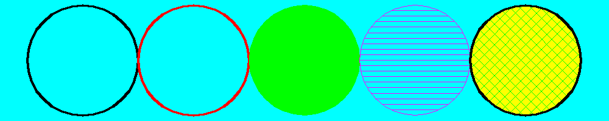

<?
<body>
  
  

    

      

      

      <h3><a name="0">NAME</a></h3>
      <blockquote>
        <b>circle(3f)</b> - [M_draw:ARCS] Draw a circle. <b></b>
      </blockquote>
      <h3><a name="5">SYNOPSIS</a></h3>
      <blockquote>
        <pre>
subroutine <b>circle</b>(<i>x</i>, <i>y</i>, <i>radius</i>)
<b>real,intent</b>(<i>in</i>) :: <i>x</i>
<b>real,intent</b>(<i>in</i>) :: <i>y</i>
<b>real,intent</b>(<i>in</i>) :: <i>radius</i>
</pre>
      </blockquote>
      <h3><a name="2">DESCRIPTION</a></h3>
      <blockquote>
        
Draw a circle. <i>x</i>, <i>y</i>, and <i>radius</i> are values <i>in</i> world units.

        
Draw a circle using current line width and color

      </blockquote>
      <h4><a name="">NOTE</a></h4>
      <blockquote>
        
circles are regarded as polygons, so if polyfill or polyhatch has been called with .true., the circle will be filled or hatched accordingly.

      </blockquote>
      <h3><a name="3">OPTIONS</a></h3>
      <blockquote>
        <table cellpadding="3">
          <tr valign="top">
            <td class="c50" width="6%" nowrap="nowrap">X,Y</td>
            <td valign="bottom">Coordinates for the center of the circle</td>
          </tr>
          <tr valign="top">
            <td class="c50" width="6%" nowrap="nowrap">RADIUS</td>
            <td valign="bottom">Radius of the circle</td>
          </tr>
        </table>
      </blockquote>
      <h3><a name="4">EXAMPLE</a></h3>
      <blockquote>
        Sample program:
        <pre>
   program demo_circle
      use M_draw
      use M_drawPLUS, only : page
      use M_draw,    only  : D_BLACK,   D_WHITE
      use M_draw,    only  : D_RED,     D_GREEN,    D_BLUE
      use M_draw,    only  : D_YELLOW,  D_MAGENTA,  D_CYAN
      implicit none
      real :: b=0.5
      real :: R=5
      integer :: ipaws
   ! set up drawing surface
      call prefsize(1000,200)
      call vinit(' ') ! start graphics using device $M_DRAW_DEVICEDEVICE
      call page(-25.0-b,25.0+b,-R-b,R+b)
      call linewidth(200)
      call color(D_CYAN)
      call clear()
   ! draw circles with hatching and fill
      call color(D_WHITE)
      call circle(-20.0,0.0, R)
      call color(D_RED)
      call circle(-10.0,0.0, R)
      call polyfill(.true.)
      call color(D_GREEN)
      call circle(0.0,0.0,R)
      call linewidth(20)
      call polyhatch(.true.)
      call hatchpitch(1.0/2.0)
      call color(D_MAGENTA)
      call circle(10.0,0.0,R)
   ! layer calls to get a filled crosshatched circle
   ! first a solid colored circle
      call color(D_YELLOW)
      call polyfill(.true.)
      call circle(20.0,0.0,R)
    ! draw hatch lines at 45 degrees
      call color(D_GREEN)
      call linewidth(80)
      call polyhatch(.true.)
      call hatchpitch(2.0/3.0)
      call hatchang(45.0)
      call circle(20.0,0.0,R)
   ! draw hatch lines at -45 degrees
      call hatchang(-45.0)
      call circle(20.0,0.0,R)
    ! outline circle with a thick border
      call color(D_WHITE)
      call linewidth(160)
      call polyhatch(.false.)
      call circle(20.0,0.0,R)
       ipaws=getkey()
   ! exit graphics mode
      call vexit()
   end program demo_circle
 
</pre>
      </blockquote>
      

       
      

    

  

</body>
