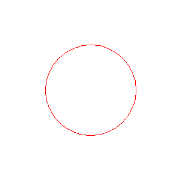

<?
<body>
  
  

    

      

      

      <h3><a name="0">NAME</a></h3>
      <blockquote>
        <b>clear(3f)</b> - [M_draw:COLOR] Clears screen to current color <b></b>
      </blockquote>
      <h3><a name="4">SYNOPSIS</a></h3>
      <blockquote>
        <pre>
subroutine <b>clear</b>()
</pre>
      </blockquote>
      <h3><a name="2">DESCRIPTION</a></h3>
      <blockquote>
        
Clears the screen to the current color. Causes a new page to begin on file-based devices that support multiple pages (Currently, the pixmap
        devices do not support multiple pages).

      </blockquote>
      <h3><a name="3">EXAMPLE</a></h3>
      <blockquote>
        Sample program:
        <pre>
     program demo_clear
     use M_draw, only  : prefsize, vinit, ortho2, clear, getkey
     use M_draw, only  : vexit, color, circle, polyfill
     use M_draw, only  : D_BLACK,   D_WHITE
     use M_draw, only  : D_RED,     D_GREEN,    D_BLUE
     use M_draw, only  : D_YELLOW,  D_MAGENTA,  D_CYAN
     implicit none
     integer :: ipaws
      call prefsize(300,300)
     call vinit(' ') ! start graphics using device $M_DRAW_DEVICEDEVICE
     ipaws=getkey()
     call ortho2(-100.0,100.0,-100.0,100.0)
      call color(D_BLACK)               ! set current  color
     call clear()                ! clear background to current color
     call color(D_RED)               ! set color to draw with
     call circle(0.0,0.0,50.0)
     ipaws=getkey()              ! pause for a keypress on interactive devices
      call color(D_GREEN)               ! make a second page
     call clear()
     call polyfill(.true.)
     call color(D_YELLOW)
     call circle(0.0,0.0,50.0)
     ipaws=getkey()
      call vexit()
      end program demo_clear
 
</pre>
      </blockquote>
      

       
      

    

  

</body>
