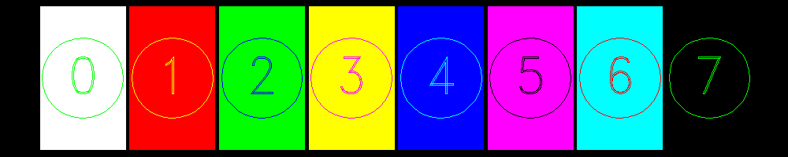

<?
<body>
  
  

    

      

      

      <h3><a name="0">NAME</a></h3>
      <blockquote>
        <b>color(3f)</b> - [M_draw:COLOR] Set current color <b></b>
      </blockquote>
      <h3><a name="5">SYNOPSIS</a></h3>
      <blockquote>
        <pre>
subroutine <b>color</b>(<i>col</i>)
<b>integer,intent</b>(<i>in</i>) :: <i>col</i>
</pre>
      </blockquote>
      <h3><a name="2">DESCRIPTION</a></h3>
      <blockquote>
        
Set the current color. The standard colors are as follows:

        <pre>
      d_black  =  0  d_red      =  1  d_green  =  2  d_yellow  =  3
      d_blue   =  4  d_magenta  =  5  d_cyan   =  6  d_white   =  7
 
</pre>
      </blockquote>
      <h3><a name="3">OPTION</a></h3>
      <blockquote>
        <table cellpadding="3">
          <tr valign="top">
            <td class="c70" width="6%" nowrap="nowrap">COL</td>
            <td valign="bottom">A color number from 0 to 255. To define additional colors see <b>mapcolor</b>(3f).</td>
          </tr>
        </table>
      </blockquote>
      <h3><a name="4">EXAMPLE</a></h3>
      <blockquote>
        Sample program:
        <pre>
    program demo_color
    use M_draw
    use M_drawPLUS, only : page
    use M_strings,  only : v2s
    real    :: b=0.5
    real    :: y1,y2,ym,x1,x2
    real    :: width=50.0/8.0,width2
    integer :: i
    integer :: ipaws
       !! set up long bar as plotting area
       call prefsize(1000,200)
       call vinit(' ') ! start graphics using device $M_draw_DEVICE
       call page(-25.0-b, 25.0+b, -5.0-b, 5.0+b)
       call textsize( 3.5, 4.0)
       call font('futura.m')
       call centertext(.true.)
       call linewidth(90)
       y1=-5
       y2=5
       ym=0
       x1=-25+.05*width
       ! draw colored rectangle and a circle and label center of circle
       ! and repeat from colors 0 to 7.
       width2=width*0.95
       call linewidth(40)
       do i=0,7
          call color(i)
          x2=x1+width2
          call polyfill(.true.)
          call makepoly()
          call rect(x1,y1,x2,y2)
          call closepoly()
          call color(mod(i+1,7)+1)
          call move2((x1+x2)/2.0,ym)
          call drawstr((v2s(i)))     ! convert number to string and draw it
          call polyfill(.false.)
          call circle((x1+x2)/2.0, ym, (x2-x1)/2.10)
          x1=x1+width
       enddo
       ipaws=getkey()
       call vexit()
    end program demo_color
 
</pre>
      </blockquote>
      

       
      

    

  

</body>
