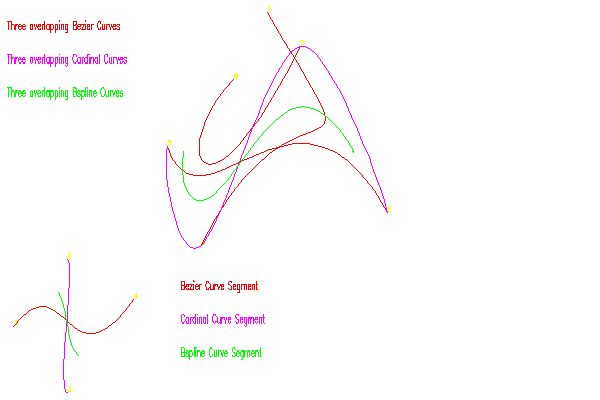

<?
<body>
  
  

    

      

      

      <h3><a name="0">NAME</a></h3>
      <blockquote>
        <b>curve(3f)</b> - [M_draw:CURVE] Draw a curve. <b></b>
      </blockquote>
      <h3><a name="4">SYNOPSIS</a></h3>
      <blockquote>
        <pre>
subroutine <b>curve</b>(<i>geom</i>)
real <i>geom</i>(3,4)
</pre>
      </blockquote>
      <h3><a name="2">DESCRIPTION</a></h3>
      <blockquote>
        Draw a curve.
      </blockquote>
      <h3><a name="3">EXAMPLE</a></h3>
      <blockquote>
        Sample Program:
        <pre>
   program demo_curve
   !
   !      using curves
   !
   use M_draw
    integer i
   character(len=50) :: buf
   real bezier(4, 4), cardinal(4, 4), bspline(4, 4)
   real geom1(3, 4), geom2(3, 6)
   !
   ! curve basis types
   !
   data bezier /                                            &amp;
   &amp;          -1.0,   3.0,    -3.0,   1.0,                  &amp;
   &amp;          3.0,    -6.0,   3.0,    0.0,                  &amp;
   &amp;          -3.0,   3.0,    0.0,    0.0,                  &amp;
   &amp;          1.0,    0.0,    0.0,    0.0                   &amp;
   &amp;  /
    data cardinal /                                          &amp;
   &amp;          -0.5,   1.5,    -1.5,   0.5,                  &amp;
   &amp;          1.0,    -2.5,   2.0,    -0.5,                 &amp;
   &amp;          -0.5,   0.0,    0.5,    0.0,                  &amp;
   &amp;          0.0,    1.0,    0.0,    0.0                   &amp;
   &amp;  /
    data bspline /                                           &amp;
   &amp;          -0.166666,     0.5,     -0.5,     0.166666,   &amp;
   &amp;           0.5,         -1.0,      0.5,     0.0,        &amp;
   &amp;          -0.5,          0.0,      0.5,     0.0,        &amp;
   &amp;           0.166666,     0.666666, 0.166666, 0.0        &amp;
   &amp;  /
    !
   ! Geometry matrix to demonstrate basic spline segments
   !
   data geom1 /                      &amp;
   &amp;           -180.0, 10.0, 0.0,    &amp;
   &amp;           -100.0, 110.0, 0.0,   &amp;
   &amp;           -100.0, -90.0, 0.0,   &amp;
   &amp;           0.0, 50.0, 0.0        &amp;
   &amp;  /
    !
   ! Geometry matrix to demonstrate overlapping control points to
   ! produce continuous (Well, except for the bezier ones) curves
   ! from spline segments
   !
   data geom2 /                      &amp;
   &amp;          200.0, 480.0, 0.0,     &amp;
   &amp;          380.0, 180.0, 0.0,     &amp;
   &amp;          250.0, 430.0, 0.0,     &amp;
   &amp;          100.0, 130.0, 0.0,     &amp;
   &amp;          50.0,  280.0, 0.0,     &amp;
   &amp;          150.0, 380.0, 0.0      &amp;
   &amp;  /
     print*,'Enter output device:'
   read(*,'(a)',iostat=ios) buf
   if(ios.ne.0)buf=' '
    call vinit(buf)
    call ortho2(-200.0, 400.0, -100.0, 500.0)
    call color(D_BLACK)
   call clear()
    call color(D_YELLOW)
    call textsize(10.0, 10.0)
   !
   ! label the control points in geom1
   !
   do i = 1, 4
      call move2(geom1(1, i), geom1(2, i))
      write(buf, '(i1)')i
      call drawstr(buf)
   enddo
   !
   ! label the control points in geom2
   !
   do i = 1, 6
      call move2(geom2(1, i), geom2(2, i))
      write(buf, '(i1)')i
      call drawstr(buf)
   enddo
   !
   ! scale the current font so that 30 of the largest characters
   ! in the current font will fit in a region 300 world units wide,
   ! 20 high.
   !
   call boxfit(300.0, 20.0, 30)
    !
   ! set the number of line segments appearing in each curve to 20
   !
   call curveprecision(20)
    !
   ! copy the bezier basis matrix into the curve basis matrix.
   !
   call curvebasis(bezier)
    call color(D_RED)
    !
   ! draw a curve using the current basis matrix (bezier in this case)
   ! and the control points in geom1
   !
   call curve(geom1)
    call move2(70.0, 60.0)
   call drawstr('Bezier Curve Segment')
    call move2(-190.0, 450.0)
   call drawstr('Three overlapping Bezier Curves')
    !
   ! curven draws overlapping curve segments according to geom2, the
   ! number of curve segments drawn is three less than the number of
   ! points passed, assuming there are a least four points in the
   ! geometry matrix (in this case geom2). This call will draw 3
   ! overlapping curve segments in the current basis matrix - still
   ! bezier.
   !
   call curven(6, geom2)
    idum=getkey()
   !
   ! load in the cardinal basis matrix
   !
   call curvebasis(cardinal)
    call color(D_MAGENTA)
    call move2(70.0, 10.0)
   call drawstr('Cardinal Curve Segment')
   !
   ! plot out a curve segment using the cardinal basis matrix
   !
   call curve(geom1)
    call move2(-190.0, 400.0)
   call drawstr('Three overlapping Cardinal Curves')
   !
   ! now draw a bunch of them again.
   !
   call curven(6, geom2)
    idum=getkey()
   !
   ! change the basis matrix again
   !
   call curvebasis(bspline)
    call color(D_GREEN)
    call move2(70.0, -40.0)
   call drawstr('Bspline Curve Segment')
   !
   ! now draw our curve segment in the new basis...
   !
   call curve(geom1)
    call move2(-190.0, 350.0)
   call drawstr('Three overlapping Bspline Curves')
   !
   ! ...and do some overlapping ones
   !
   call curven(6, geom2)
    idum=getkey()
    call vexit()
    end program demo_curve
 
</pre>
      </blockquote>
      

       
      

    

  

</body>
