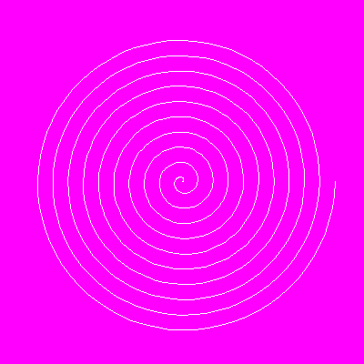

<?
<body>
  
  

    

      

      

      <h3><a name="0">NAME</a></h3>
      <blockquote>
        <b>draw2(3f)</b> - [M_draw:DRAW] Draw from current graphics position to given point (x, y) <b></b>
      </blockquote>
      <h3><a name="5">SYNOPSIS</a></h3>
      <blockquote>
        <pre>
subroutine <b>draw2</b>(<i>x</i>, <i>y</i>)
<b>real,intent</b>(<i>in</i>) :: <i>x</i>, <i>y</i>
</pre>
      </blockquote>
      <h3><a name="2">DESCRIPTION</a></h3>
      <blockquote>
        Draw from current position to specified point using current color and line width. Updates current position to new point. (<i>x</i>, <i>y</i>) is a
        point <i>in</i> world coordinates.
      </blockquote>
      <h3><a name="3">OPTIONS</a></h3>
      <blockquote>
        <table cellpadding="3">
          <tr valign="top">
            <td class="c95" width="6%" nowrap="nowrap">X</td>
            <td valign="bottom">new X position</td>
          </tr>
          <tr valign="top">
            <td class="c95" width="6%" nowrap="nowrap">Y</td>
            <td valign="bottom">new Y position</td>
          </tr>
        </table>
      </blockquote>
      <h3><a name="4">EXAMPLE</a></h3>
      <blockquote>
        Sample program:
        <pre>
   program demo_draw2
   use M_draw,    only : prefsize, vinit, ortho2, clear, getkey
   use M_draw,    only : move2, draw2, vexit, color,linewidth
   use M_draw,    only  : D_BLACK,   D_WHITE
   use M_draw,    only  : D_RED,     D_GREEN,    D_BLUE
   use M_draw,    only  : D_YELLOW,  D_MAGENTA,  D_CYAN
   use M_units,   only : d2r, polar_to_cartesian
   !
   ! The Archimedean spiral is the locus of points corresponding
   ! to the locations over time of a point moving away from a
   ! fixed point with a constant speed along a line which rotates
   ! with constant angular velocity.
   !    r=A+B*theta
   ! Changing the parameter A will turn the spiral,
   ! while B controls the distance between successive turnings.
   !
      implicit none
      integer        :: i
      real           :: x,y,radius,theta
      real,parameter :: rotate=0.0, gap=2.0
      integer        :: ipaws
       call prefsize(400,400)
      call vinit(' ') ! start graphics using device $M_DRAW_DEVICEDEVICE
      call ortho2(-150.0,150.0,-150.0,150.0)
      call color(D_MAGENTA)
      call clear()
      call move2(0.0,0.0)
      call color(D_BLACK)
      call linewidth(40)
      do i=0,360*10,5
         theta=d2r(i)
         ! equation in polar coordinates
         radius=rotate+gap*theta
         ! convert polar coordinates to cartesian
         call polar_to_cartesian(radius,theta,x,y)
         ! draw from current position to end of next segment
         call draw2(x,y)
      enddo
      ipaws=getkey()
      ! exit graphics mode
      call vexit()
   end program demo_draw2
 
</pre>
      </blockquote>
      

       
      

    

  

</body>
