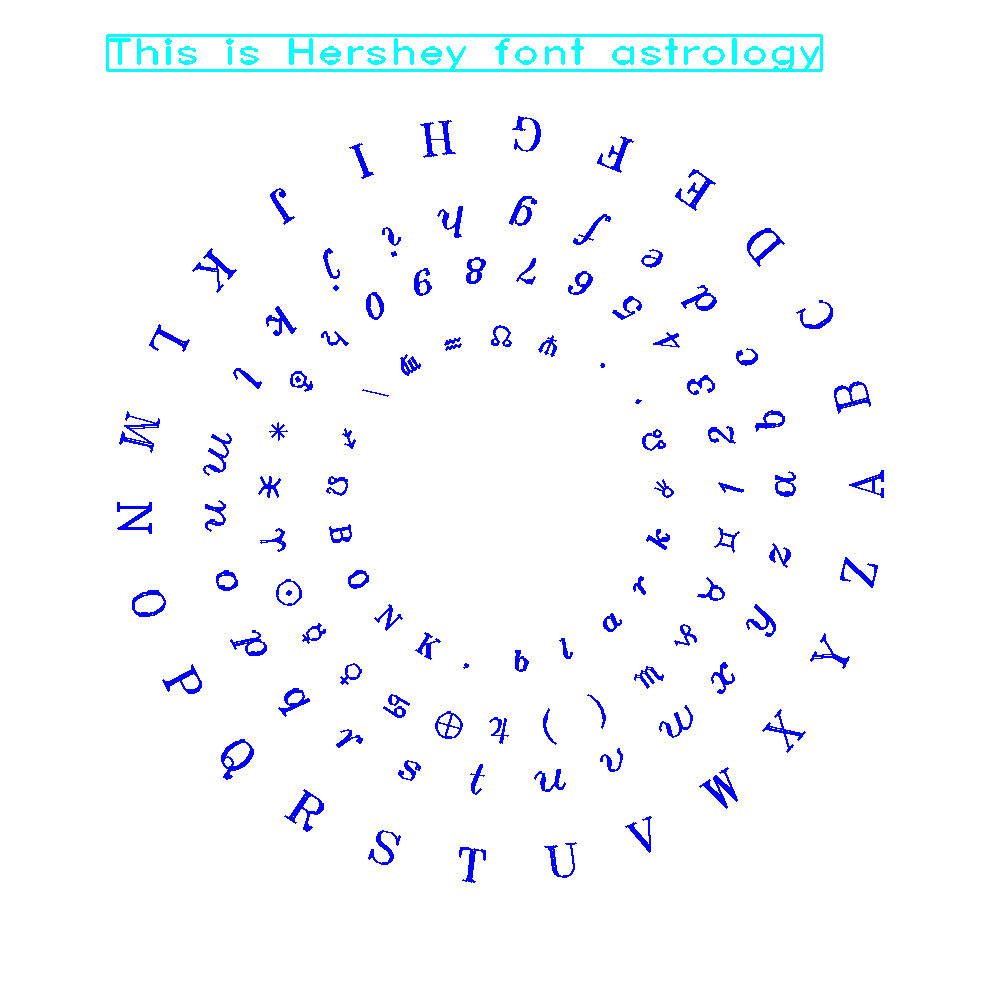

<?
<body>
  
  

    

      

      

      <h3><a name="0">NAME</a></h3>
      <blockquote>
        <b>drawchar(3f)</b> - [M_draw:TEXT] Draw the character c and update current position. <b></b>
      </blockquote>
      <h3><a name="4">SYNOPSIS</a></h3>
      <blockquote>
        <pre>
subroutine <b>drawchar</b>(<i>ch</i>)
<b>character</b>(len=1),intent(<i>in</i>) :: <i>ch</i>
</pre>
      </blockquote>
      <h3><a name="2">DESCRIPTION</a></h3>
      <blockquote>
        
Draw the character c at the current position. The current graphics position represents the bottom left hand corner of the character space.

        
Uses current line color and thickness and text justification mode.

      </blockquote>
      <h3><a name="3">EXAMPLE</a></h3>
      <blockquote>
        Sample program:
        <pre>
   program demo_drawchar
   !
   !      display all the hershey fonts and demonstrate textang
   !
    use M_draw, only: vinit, vsetflush, color, clear, font, vexit, vflush
   use M_draw, only: ortho2, textang, boxtext, rect, textsize, getkey
   use M_draw,    only  : D_BLACK,   D_WHITE
   use M_draw,    only  : D_RED,     D_GREEN,    D_BLUE
   use M_draw,    only  : D_YELLOW,  D_MAGENTA,  D_CYAN
   use M_draw
    character(len=40)   :: str1, str2, str3, str4, fonts(22)
   character(len=100)  :: buf
   character(len=1)    :: c
   integer             :: i
   data fonts/ 'astrology', 'cursive',    'futura.l',               &amp;
   &amp;      'futura.m',  'gothic.eng', 'gothic.ger',             &amp;
   &amp;      'gothic.ita','greek',      'japanese',    'markers', &amp;
   &amp;      'math.low',  'math.upp',   'meteorology', 'music',   &amp;
   &amp;      'cyrillic',  'script',     'symbolic',    'times.g', &amp;
   &amp;      'times.ib',  'times.i',    'times.r',     'times.rb' /
    data str1/ 'ABCDEFGHIJKLMNOPQRSTUVWXYZ' /
   data str2/ 'abcdefghijklmnopqrstuvwxyz' /
   data str3/ '1234567890+-=!@#$%^&amp;*(){}[]' /
   data str4/ '&lt;&gt;,./?~'\|_BONK,blark' /
   integer :: idum
   print*,'Enter output device:'
   read(*,'(a)',iostat=ios)buf
   if(ios.ne.0)buf=' '
   call prefsize(1000,1000)
   call vinit(buf)
   call vsetflush(.false.)
   call linewidth(20)
   call clear()
   ! define the world space
   call ortho2(-14.0, 14.0, -14.0, 14.0)
   do i = 1, 22
      ! do the title
      call textang(0.0)                 ! reset text angle so title is straight
      call color(D_CYAN)
      call font('futura.m')
      write(buf, '(''This is Hershey font '',a)') fonts(i)
      !call printattribs('before')
      call boxtext(-11.0, 12.0, 20.0, 1.0, buf)
      !call printattribs('after')
      call rect(-11.0, 12.0, 9.0, 13.0) ! draw a box around the title
      call font(fonts(i))               ! grab a font from the table
      call color(D_BLUE)
      ! show the outer ring
      call textsize(1.5, 1.5)
      call ShowCircularText(11.0, str1)
      ! show the second ring
      call textsize(1.3, 1.3)
      call ShowCircularText(8.5, str2)
      ! show the third ring
      call textsize(1.1, 1.1)
      call ShowCircularText(7.0, str3)
      ! show the inside ring
      call textsize(0.9, 0.9)
      call ShowCircularText(5.0, str4)
      call vflush()
       idum= getkey()
      select case(idum)
       case(:-1,ichar('q'),ichar('Q'))
         exit
      end select
       call color(D_BLACK)
      call clear()
   enddo
   call vexit()
   contains
    subroutine ShowCircularText(r, str)  ! show a ring of text
      use M_draw, only : move2, textang, drawchar
       real              :: r
      character(len=*)  :: str
      real              :: i, inc, x, y, a
      integer           :: j
      character(len=1)  :: c
      real,parameter    :: pi = 3.1415926535
       j = 1
      inc = 360.0 / len_trim(str)
       i=0.0
      do i10 = 1,len_trim(str)
         !
         ! calculate the next drawing position
         c = str(j:j)
         x = r * cos(i * pi / 180.0)
         y = r * sin(i * pi / 180.0)
         call move2(x, y)
         !
         ! calculate angle for next character
         a = 90.0 + i
         !
         ! set the orientation of the next character
         call textang(a)
         !
         ! draw the character
         call drawchar(c)
         j = j + 1
         i=i+inc
      enddo
    end subroutine ShowCircularText
    end program demo_drawchar
 
</pre>
      </blockquote>
      

       
      

    

  

</body>
