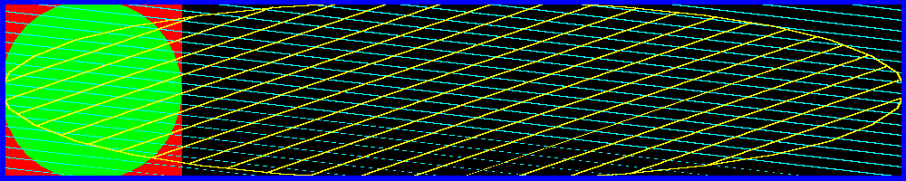

<?
<body>
  
  

    

      

      

      <h3><a name="0">NAME</a></h3>
      <blockquote>
        <b>expandviewport(3f)</b> - [M_draw:VIEWPORT] use the entire device viewport <b></b>
      </blockquote>
      <h3><a name="4">SYNOPSIS</a></h3>
      <blockquote>
        <pre>
subroutine <b>expandviewport</b>()
</pre>
      </blockquote>
      <h3><a name="2">DESCRIPTION</a></h3>
      <blockquote>
        
When M_draw does viewport calculations, it will normally begin by using the largest square it can fit onto the actual display device. This call
        says to use the whole device... however you must then take into account any distortion that will occur due to the non-square mapping. Thus, a
        viewport of (<b>-1.0</b>, 1.0, <b>-1.0</b>, 1.0) will map into the whole display device.

      </blockquote>
      <h3><a name="3">EXAMPLE</a></h3>
      <blockquote>
        Sample program:
        <pre>
   program demo_expandviewport
   use M_draw
   use M_draw,    only  : D_BLACK,   D_WHITE
   use M_draw,    only  : D_RED,     D_GREEN,    D_BLUE
   use M_draw,    only  : D_YELLOW,  D_MAGENTA,  D_CYAN
   implicit none
   integer :: ipaws
    !! set up graphics area
   call prefsize(1000,200)
   call vinit(' ') ! start graphics using device $M_draw_DEVICE
    !! draw box that fills default world coordinate window
   call color(D_RED)
   call polyfill(.true.)
   call rect(-1.0, -1.0, 1.0, 1.0)
   call color(D_GREEN)
   call circle(0.0,0.0,1.0)
    call expandviewport()
   !! the meaning of viewport numbers has now changed, but the
   !! viewport itself has not. Now &lt;-1,-1&gt; &lt;1,1&gt; defines the
   !! entire display area, where before it defined the largest square
   !! that would fit on the display
   call viewport(-1.0,1.0,-1.0,1.0)
   !! draw box that fills default world coordinate window again
    !! instead of a square and circle, the mapping now
   !! produces an ellipse and rectangle unless this
   !! device has a square display
   call polyhatch(.true.)
   call hatchpitch(0.1)
   call hatchang(30.0)
   call linewidth(20)
   call color(D_CYAN)
   call rect(-1.0, -1.0, 1.0, 1.0)
   call color(D_YELLOW)
   call hatchang(120.0)
   call circle(0.0,0.0,1.0)
    !! border
   call linewidth(100)
   call color(D_BLUE)
   call move2(-1.0, -1.0)
   call draw2(-1.0, 1.0)
   call draw2(1.0, 1.0)
   call draw2(1.0, -1.0)
   call draw2(-1.0, -1.0)
    call vflush(); ipaws=getkey() !! pause
   call vexit()                  !! wrap up graphics
    end program demo_expandviewport
</pre>
      </blockquote>
      

       
      

    

  

</body>
