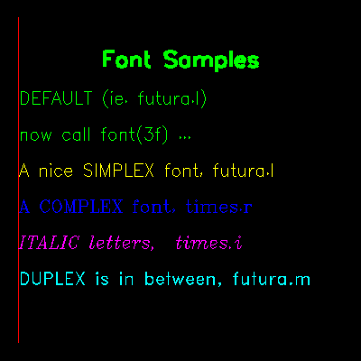

<?
<body>
  
  

    

      

      

      

      <h3><a name="0">NAME</a></h3>
      <blockquote>
        <b>font(3f)</b> - [M_draw:TEXT] Set the current font by name <b></b>
      </blockquote>
      <h3><a name="4">SYNOPSIS</a></h3>
      <blockquote>
        <pre>
subroutine <b>font</b>(<i>fontname</i>)
<b>character</b>(len=*),intent(<i>in</i>) :: <i>fontname</i>
</pre>
      </blockquote>
      <h3><a name="2">DESCRIPTION</a></h3>
      <blockquote>
        Set the current font.
        
M_draw supports hardware and software fonts. The software fonts are based on the character set digitized by Dr Allen V. Hershey while working at
        the U. S. National Bureau of Standards. Exactly what hardware fonts are supported depends on the device, but it is guaranteed that the names "large"
        and "small" will result <i>in</i> something readable. For X11 displays the default large and small fonts used by the program can be overridden by
        placing the following defaults <i>in</i> the ~/.Xdefaults file:

        <pre>
     draw.smallfont: X11-font-name
     draw.largefont: X11-font-name
 
</pre>It is noted here that hardware text is always assumed to be drawn parallel to the (x, y) plane, using whatever the current z coordinate is. The
following software fonts are supported:
        <pre>
      astrology       cursive         cyrillic        futura.l
      futura.m        gothic.eng      gothic.ger      gothic.ita
      greek           markers         math.low        math.upp
      meteorology     music           script          symbolic
      times.g         times.i         times.ib        times.r
      times.rb        japanese
 
</pre>A markers font "markers" is also provided for doing markers - you need to have centertext mode on for this to give sensible results when placing the
markers.
        
If the environment variable "M_draw_FONTPATH" is set M_draw looks for the software fonts <i>in</i> the directory given by this value.

        
WHEN ASKED FOR NON-EXISTENT FONT NAMES, <b>FONT</b>(3f) STOPS THE PROGRAM.

      </blockquote>
      <h3><a name="3">EXAMPLE</a></h3>
      <blockquote>
        Sample Program:
        <pre>
   program demo_font
   use :: M_draw
   use M_draw,    only  : D_BLACK,   D_WHITE
   use M_draw,    only  : D_RED,     D_GREEN,    D_BLUE
   use M_draw,    only  : D_YELLOW,  D_MAGENTA,  D_CYAN
   real    :: left
   real    :: baseline=80.0
   integer :: icolor=1
   integer :: ipaws
      !! set up drawing surface
      call prefsize(400, 400)
      call vinit(' ') ! start graphics using device $M_DRAW_DEVICEDEVICE
      call page(-100.0, 100.0, -100.0, 100.0)
      call color(D_WHITE)
      call clear()
      call textsize(10.0, 10.0)
      !! place a vertical line along the edge
      call color(D_RED)
      call move2(-90.0, -90.0)
      call draw2(-90.0, 90.0)
      !! make a centered title at top a bit bolder and bigger
      call xcentertext()
      call textsize(13.0, 13.0)
      call linewidth(90)
      left=0
      call nextline('Font Samples')
      !! print the font samples
      left=-90
      call linewidth(40)
      call textsize(10.0, 10.0)
      call centertext(.false.)
      icolor=icolor-1
      call nextline('DEFAULT (ie. futura.l)')
      icolor=icolor-1
      call nextline('now call font(3f) ...')
      call nextline('A nice SIMPLEX font, futura.l')
      call nextline('A COMPLEX font, times.r')
      call nextline('ITALIC letters,  times.i')
      call nextline('DUPLEX is in between, futura.m')
      ipaws=getkey()
      call vexit()
   contains
   subroutine nextline(string)
   character(len=*) :: string
   !! reduce some duplicate code; very specific to this EXAMPLE
      integer :: iend
      iend=index(string,',')  ! if comma, assume font name found
      write(*,*)'FONT=',string(iend+1:),iend
      if(iend.ne.0)call font(trim(adjustl(string(iend+1:)))) ! change font
      icolor=icolor+1         ! set pen color
      call color(icolor)
      baseline=baseline-20    ! move down before drawing line
      call move2(left, baseline)
      call drawstr(string)    ! draw string
   end subroutine nextline
    end program demo_font
 
</pre>
      </blockquote>
      

       
      

    

  

</body>
