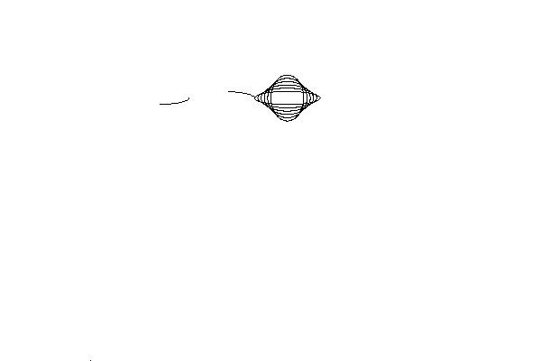

<?
<body>
  
  

    

      

      

      <h3><a name="0">NAME</a></h3>
      <blockquote>
        <b>getdisplaysize(3f)</b> - [M_draw:ASPECT] Returns width and height of device in device units <b></b>
      </blockquote>
      <h3><a name="3">SYNOPSIS</a></h3>
      <blockquote>
        <pre>
subroutine <b>getdisplaysize</b>(<i>w</i>, <i>h</i>)
<b>real,intent</b>(<i>in</i>) :: <i>w</i>, <i>h</i>
</pre>
      </blockquote>
      <h3><a name="2">DESCRIPTION</a></h3>
      <blockquote>
        Returns the width and height of the device <i>in</i> device units <i>in</i> <i>w</i> and <i>h</i> respectively.
      </blockquote>
      

       
      

    

  

</body>
