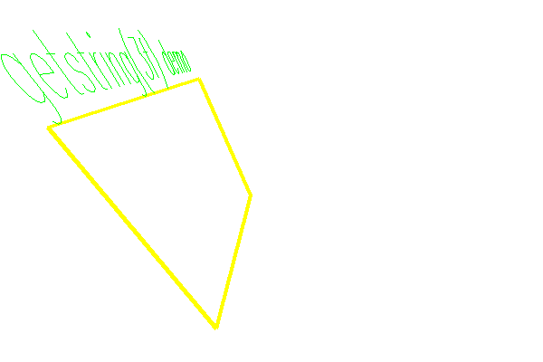

<?
<body>
  
  

    

      

      

      <h3><a name="0">NAME</a></h3>
      <blockquote>
        <b>getstring(3f)</b> - [M_draw:INTERACTIVE] Read in a string, echoing it in current font <b></b>
      </blockquote>
      <h3><a name="6">SYNOPSIS</a></h3>
      <blockquote>
        <pre>
integer function <b>getstring</b>(<i>bcol</i>, <i>string</i>)
integer <i>bcol</i>
character *(*) <i>string</i>
</pre>
      </blockquote>
      <h3><a name="2">DESCRIPTION</a></h3>
      <blockquote>
        
Read in a <i>string</i>, echoing it in the current font, using the current color and the current transformation.

        
<b>getstring</b>(3f) interprets the Backspace key (ASCII 8) and the Del key (ASCII 127) as erasing characters. An EOT (ASCII 4) or a Carriage
        return (ASCII 13) will terminate input.

      </blockquote>
      <h3><a name="3">OPTIONS</a></h3>
      <blockquote>
        <table cellpadding="3">
          <tr valign="top">
            <td class="c165" width="6%" nowrap="nowrap">BCOL</td>
            <td valign="bottom">is the background color which is used for erasing characters after a backspace or a delete key is received.</td>
          </tr>
        </table>
      </blockquote>
      <h3><a name="4">RETURNS</a></h3>
      <blockquote>
        <b>getstring</b>(3f) returns the number of characters read. Getstring does not check for overflow in the input buffer <i>string</i>.
      </blockquote>
      <h3><a name="5">EXAMPLE</a></h3>
      <blockquote>
        Sample program:
        <pre>
   program demo_getstring
   use M_draw
   ! reading a string from graphic input with getstring(3f)
   character(len=128) :: buf(10)
   character(len=20)  :: dev
   character(len=20)  :: fname
   integer            :: ios
    print*, 'Enter device:'
   read (*, '(a)',iostat=ios) dev
   if(ios.ne.0)dev=' '
    print*, 'Enter a font name:'
   read (*, '(a)',iostat=ios) fname
   if(ios.ne.0)fname='futura.l'
   if(fname.eq.'')fname='futura.l'
    call vinit(dev)
    call font(fname)
    call clipping(.false.)
    shft=0.14
   call window(-1.0-shft, 1.0-shft, -1.0, 1.0, 1.0, -1.0)
   call lookat(0.0-shft, 0.0-shft, 1.0, 0.0, 0.0, 0.0, 0.0)
    call rotate(30.0, 'x')
   call rotate(30.0, 'z')
   call rotate(60.0, 'y')
    call color(D_BLACK)
   call clear()
   call color(D_YELLOW)
    tsize=0.25
   call textsize(tsize/2.5, tsize)
   call linewidth(100)
   call rect(-0.5, -0.5, 0.5, 0.5)
    y=0.5
    call linewidth(40)
   call move2(-0.5, y)
   call color(D_GREEN)
   call drawstr('getstring(3f) demo')
    write(*,*)'Enter 10 lines up to 128 characters long.'
   write(*,*)'Program ends on blank line.'
    do n=1,10
      y=y-tsize
      call move2(-0.5, y)
      i = getstring(D_BLACK, buf(n))
      write(*,'(/,a,i0,a,i0)',advance='no')'N=',n,' I=',i
      if(n.ge.1 .and. n.le.size(buf))write(*,*)' BUF=',trim(buf(n)(:i))
      buf(n)(min(128,i+1):)=' '
      if(i.le.0)exit ! exit on empty line
   enddo
    call vexit()
    do i = 1, n-1
      write(*, '(1x, ''Line'',i3,'' was: '', a)') i, buf(i)
   enddo
    end program demo_getstring
</pre>
      </blockquote>
      

       
      

    

  

</body>
