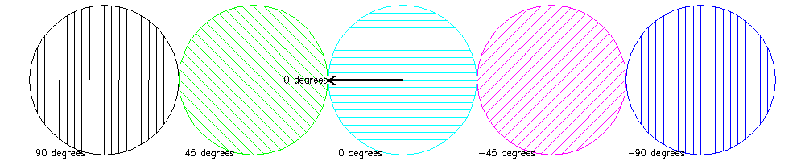

<?
<body>
  
  

    

      

      

      <h3><a name="0">NAME</a></h3>
      <blockquote>
        <b>hatchang(3f)</b> - [M_draw:POLYGONS] Set the angle of the hatch lines. <b></b>
      </blockquote>
      <h3><a name="4">SYNOPSIS</a></h3>
      <blockquote>
        <pre>
subroutine <b>hatchang</b>(<i>angle</i>)
<b>real,intent</b>(<i>in</i>) :: <i>angle</i>
</pre>
      </blockquote>
      <h3><a name="2">DESCRIPTION</a></h3>
      <blockquote>
        
Set the <i>angle</i> of the hatch lines. The <i>angle</i> is <i>in</i> degrees. Zero degrees is on the negative X axis. Positive values are
        counterclockwise. The value is 0 at program initialization. The last value set is retained even if hatching is not active or is turned on and
        off.

      </blockquote>
      <h3><a name="3">EXAMPLE</a></h3>
      <blockquote>
        Sample program:
        <pre>
   program demo_hatchang
   use M_drawplus, only : draw_interpret
   character(len=:),allocatable :: draw_cmds(:)
    DRAW_CMDS=[ CHARACTER(LEN=128) :: &amp;
   'prefsize 1000 200; vinit                                     ',&amp;
   'set b=.4; page -25-b 25+b -5-b 5+b; color 0;clear            ',&amp;
   'textsize .6 .7;font futura.l;centertext .true.               ',&amp;
   'leftjustify; linewidth 50; polyhatch .true.; hatchpitch 1/2  ',&amp;
   '# draw circles with hatching                                 ',&amp;
   'linewidth 90;hatchang  90.1; color  7;  circle X=-20  Y=0  5 ',&amp;
   'move2  X-4.9 Y=-4.9;color 7;linewidth 60;drawstr  90 degrees ',&amp;
   'linewidth 90;hatchang  45  ; color  2;  circle X=-10  Y=0  5 ',&amp;
   'move2  X-4.9 Y=-4.9;color 7;linewidth 60;drawstr  45 degrees ',&amp;
   'linewidth 90;hatchang   0  ; color  6;  circle X=-0   Y=0  5 ',&amp;
   'move2  X-4.9 Y=-4.9;color 7;linewidth 60;drawstr   0 degrees ',&amp;
   'linewidth 90;hatchang -45  ; color  5;  circle X=10   Y=0  5 ',&amp;
   'move2  X-4.9 Y=-4.9;color 7;linewidth 60;drawstr -45 degrees ',&amp;
   'linewidth 90;hatchang -90  ; color  4;  circle X=20   Y=0  5 ',&amp;
   'move2  X-4.9 Y=-4.9;color 7;linewidth 60;drawstr -90 degrees ',&amp;
   'linewidth 130                                                ',&amp;
   'move2 0 0;draw2 -5 0                                         ',&amp;
   'move2 -5 0;draw2 -4.4  0.3                                   ',&amp;
   'move2 -5 0;draw2 -4.4 -0.3                                   ',&amp;
   'rightjustify                                                 ',&amp;
   'linewidth 60                                                 ',&amp;
   'move2 -5 0;drawstr 0 degrees                                 ',&amp;
   'getkey                                                       ',&amp;
   'vexit                                                        ',&amp;
   '']
    call draw_interpret(DRAW_CMDS,delimiters=';')
   end program demo_hatchang
</pre>
      </blockquote>
      

       
      

    

  

</body>
