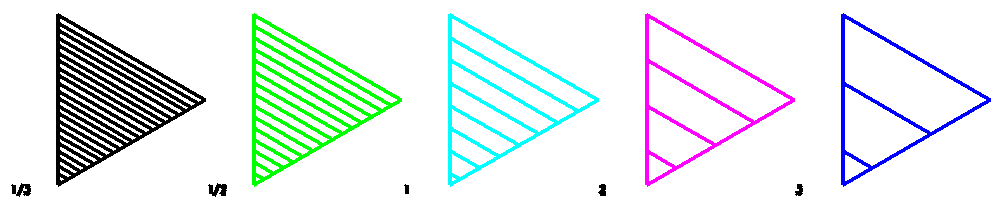

<?
<body>
  
  

    

      

      

      <h3><a name="0">NAME</a></h3>
      <blockquote>
        <b>hatchpitch(3f)</b> - [M_draw:POLYGONS] Set the distance between hatch lines. <b></b>
      </blockquote>
      <h3><a name="4">SYNOPSIS</a></h3>
      <blockquote>
        <pre>
subroutine <b>hatchpitch</b>(<i>pitch</i>)
<b>real,intent</b>(<i>in</i>) :: <i>pitch</i>
</pre>
      </blockquote>
      <h3><a name="2">DESCRIPTION</a></h3>
      <blockquote>
        Set the distance between hatch lines. The distance is measured <i>in</i> window units (as opposed to viewport or device units).
      </blockquote>
      <h3><a name="3">EXAMPLE</a></h3>
      <blockquote>
        Sample program:
        <pre>
   program demo_hatchpitch
   use M_drawplus, only : draw_interpret
   character(len=:),allocatable :: draw_cmds(:)
    DRAW_CMDS=[ CHARACTER(LEN=128) :: &amp;
   'prefsize 1000 200; vinit                                                    ',&amp;
   'set b=.1; page -25-b 25+b -5-b 5+b;color 0;clear                            ',&amp;
   'textsize .5 .6;font futura.l; leftjustify                                   ',&amp;
   'circleprecision 3                                                           ',&amp;
   '# draw circles with hatching                                                ',&amp;
   'linewidth 150; polyhatch .true.; hatchang 30                                ',&amp;
   'hatchpitch 1/3 ; color 7; circle X=-20 0 5; move2 X-4.9 -4.9;color 7;drawstr 1/3',&amp;
   'hatchpitch 1/2 ; color 2; circle X=-10 0 5; move2 X-4.9 -4.9;color 7;drawstr 1/2',&amp;
   'hatchpitch  1  ; color 6; circle X=-0  0 5; move2 X-4.9 -4.9;color 7;drawstr 1',&amp;
   'hatchpitch  2  ; color 5; circle X=10  0 5; move2 X-4.9 -4.9;color 7;drawstr 2',&amp;
   'hatchpitch  3  ; color 4; circle X=20  0 5; move2 X-4.9 -4.9;color 7;drawstr 3',&amp;
   'getkey                                                                      ',&amp;
   'vexit                                                                       ',&amp;
   '']
    call draw_interpret(DRAW_CMDS,delimiters=';')
   end program demo_hatchpitch
 
</pre>
      </blockquote>
      

       
      

    

  

</body>
