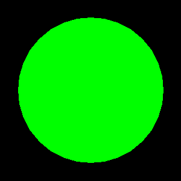

<?
<body>
  
  

    

      

      

      <h3><a name="0">NAME</a></h3>
      <blockquote>
        <b>isobj(3f)</b> - [M_draw:OBJECT] Returns non-zero if there is an object of number n. <b></b>
      </blockquote>
      <h3><a name="4">SYNOPSIS</a></h3>
      <blockquote>
        <pre>
logical function <b>isobj</b>(<i>n</i>)
integer :: <i>n</i>
</pre>
      </blockquote>
      

      <h3><a name="2">DESCRIPTION</a></h3>
      <blockquote>
        Returns non-zero if there is an object of number <i>n</i>.
      </blockquote>
      <h3><a name="3">EXAMPLE</a></h3>
      <blockquote>
        Sample program:
        <pre>
   program demo_isobj
   use M_draw
      call prefsize(300, 300)
      call prefposition(100, 100)
      call vinit(' ')   ! set up device
      call ortho2(-5.0,5.0,-5.0,5.0)
      call color(D_WHITE)  ! set current color
      call clear()   ! clear screen to current color
       call makeobj(3)  ! create a simple object
         call polyfill(.true.)
         call color(D_GREEN)
         call circle(0.0,0.0,4.0)
      call closeobj()
       if(isobj(3))then
         write(*,*)' 3 is an object (CORRECT)'
         call callobj(3)
      else
         write(*,*)' 3 is not an object (ERROR)'
      endif
       if(isobj(4))then
         write(*,*)' 4 is an object (ERROR)'
      else
         write(*,*)' 4 is not an object (CORRECT)'
      endif
       call callobj(4) ! note: calling a non-existent object is a no-op
       idum=getkey()! wait for some input
      call vexit()!  set the screen back to its original state
    end program demo_isobj
 
</pre>Expected output:
        <blockquote>
          
3 is an object (CORRECT) 4 is not an object (CORRECT)

        </blockquote>
      </blockquote>
      

       
      

    

  

</body>
