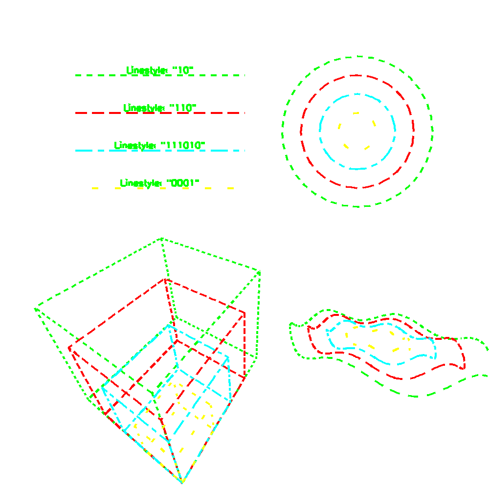

<?
<body>
  
  

    

      

      

      <h3><a name="0">NAME</a></h3>
      <blockquote>
        <b>linestyle(3f)</b> - [M_draw:LINESTYLE] set the line dash pattern <b></b>
      </blockquote>
      <h3><a name="4">SYNOPSIS</a></h3>
      <blockquote>
        <pre>
subroutine <b>linestyle</b>(<i>style</i>)
character *(*) <i>style</i>
</pre>
      </blockquote>
      <h3><a name="2">DESCRIPTION</a></h3>
      <blockquote>
        
Set the current linestyle to <i>style</i>. Linestyles are specified by giving a nominal length of a single dash and a character string consisting
        of 1's and 0's (zeros) that specify when to draw a dash and when not to draw a dash. "1" is for a dash , "0" is for a gap. Linestyles will follow
        curves and "go around" corners.

        
To reset to a solid line <i>style</i>, enter a linestyle of " ". If a linestyle is set or reset, the accumulated information as to where on a
        curve (or line) a dash is to be draw is also reset.

        
The sample program shows a line segment being drawn using the same dashcode (to specify dash length) except the linestyle is being changed. Note
        that the dashcode is in world units.

      </blockquote>
      <h3><a name="3">EXAMPLE</a></h3>
      <blockquote>
        Sample program:
        <pre>
    program demo_linestyle
    ! A program showing basic line styles.
    use M_draw
    character(len=40) :: device
    integer           :: ios
        print*,'Enter output device: '
       read(*,'(a)',iostat=ios)device
       if(ios.ne.0)device=' '
        call prefsize(1000,1000)
       call vinit(device)
       call vsetflush(.true.)
       call up(0.0, 1.0, 0.0)
       call perspective(90.0, 1.0, 0.3, 3.0)
       call translate(0.0, 0.0, -1.3)
       call linewidth(30)
        call drawscene()
       call rotate(-30.0, 'y')
       call rotate(-30.0, 'x')
       call drawscene()
        call vexit()
       contains
        subroutine drawscene()
           call color(D_BLACK)
          call clear()
           call color(D_GREEN)
          call dashcode(0.03)
           call linestyle(' ')
          call xcentertext()
          call move2(-0.45, 0.9)
          call drawstr('Linestyle: "10"')
          call move2(-0.45, 0.7)
          call drawstr('Linestyle: "110"')
          call move2(-0.45, 0.5)
          call drawstr('Linestyle: "111010"')
          call move2(-0.45, 0.3)
          call drawstr('Linestyle: "0001"')
           call linestyle('10')
          call move2(-0.9, 0.9)
          call draw2( 0.0, 0.9)
          call circle(0.6, 0.6, 0.4)
           call drawbox(0.9)
          call drawsine(0.9)
           call color(D_RED)
          call linestyle('110')
          call move2(-0.9, 0.7)
          call draw2( 0.0, 0.7)
          call circle(0.6, 0.6, 0.3)
          call drawbox(0.7)
          call drawsine(0.7)
           call color(D_CYAN)
          call linestyle('111010')
          call move2(-0.9, 0.5)
          call draw2( 0.0, 0.5)
          call circle(0.6, 0.6, 0.2)
          call drawbox(0.5)
          call drawsine(0.5)
           call color(D_YELLOW)
          call linestyle('0001')
          call move2(-0.9, 0.3)
          call draw2( 0.0, 0.3)
          call circle(0.6, 0.6, 0.1)
          call drawbox(0.3)
          call drawsine(0.3)
           idum=getkey()
           end subroutine drawscene
           subroutine drawbox(scl)
          real :: scl
           call pushmatrix()
           call rotate(30.0, 'x')
          call rotate(60.0, 'y')
          call translate(-0.7, -1.2, 0.0)
          call scale(scl, scl, scl)
           call move(0.0, 0.0, 0.0)
           call draw(1.0, 0.0, 0.0)
          call draw(1.0, 1.0, 0.0)
          call draw(0.0, 1.0, 0.0)
          call draw(0.0, 0.0, 0.0)
           call draw(0.0, 0.0, -1.0)
          call draw(1.0, 0.0, -1.0)
          call draw(1.0, 1.0, -1.0)
          call draw(0.0, 1.0, -1.0)
          call draw(0.0, 0.0, -1.0)
           call move(0.0, 1.0, -1.0)
          call draw(0.0, 1.0, 0.0)
           call move(1.0, 1.0, 0.0)
          call draw(1.0, 1.0, -1.0)
           call move(1.0, 0.0, 0.0)
          call draw(1.0, 0.0, -1.0)
           call popmatrix()
           end subroutine drawbox
           subroutine drawsine(s)
          real    s, RAD, AMP
          parameter(RAD = 0.5, AMP = 0.04)
          real    a, x, y, z
           call pushmatrix()
           call translate(RAD + 0.2, -0.5, 0.0)
          call scale(s, s, s)
           call move(RAD, 0.0, 0.0)
          a=0.0
          do i10 = 0,2*314,2
             x = RAD * cos(a)
             z = RAD * sin(a)
             y = AMP * sin(a * 6.0)
              call draw(x, y, z)
             a=a+0.02
          enddo
          call popmatrix()
          end subroutine drawsine
</pre>end program demo_linestyle
      </blockquote>
      

       
      

    

  

</body>
