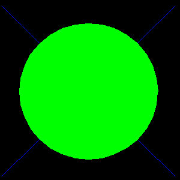

<?
<body>
  
  

    

      

      

      <h3><a name="0">NAME</a></h3>
      <blockquote>
        <b>loadobj(3f)</b> - [M_draw:OBJECT] Load the object in the file filename as object number n. <b></b>
      </blockquote>
      <h3><a name="4">SYNOPSIS</a></h3>
      <blockquote>
        <pre>
subroutine <b>loadobj</b>(<i>n</i>, <i>filename</i>)
integer <i>n</i>
character*(*) <i>filename</i>
</pre>
      </blockquote>
      <h3><a name="2">DESCRIPTION</a></h3>
      <blockquote>
        Load the object in the file "<i>filename</i>" as object number <i>n</i>.
      </blockquote>
      <h3><a name="3">EXAMPLE</a></h3>
      <blockquote>
        Sample program:
        <pre>
   program demo_loadobj
   ! test some object-related procedures
   use M_draw
   integer                      :: env_len
   character(len=:),allocatable :: env
      !------------------------------------------------------------
      ! make an object file, which would normally be
      ! made by a separate program
      call voutput('+')
      call vinit('nil')   ! set up device
      call makeobj(3)
         call polyfill(.true.)
         call color(D_GREEN)
         call circle(0.0,0.0,4.0)
      call closeobj()
      call saveobj(3,"circle.obj")
      call vexit()
      !------------------------------------------------------------
      ! CURRENTLY:
      ! with multiple vinit(3f) calls the environment variable is
      ! not used without explicitly using it
      call get_environment_variable('M_DRAW_OUTPUT',LENGTH=env_len)
      if(env_len.ne.0)then
         allocate(character(len=env_len) :: env)
         call get_environment_variable('M_DRAW_OUTPUT',env)
         call voutput(env)
      endif
      !------------------------------------------------------------
      call prefsize(300, 300)
      call prefposition(100, 100)
      call vinit(' ')   ! set up device
      call ortho2(-5.1,5.3,-5.2,5.4)
      call color(D_WHITE)  ! set current color
      call clear()   ! clear screen to current color
      call color(D_BLUE)
      call move2(-5.0,-5.0)
      call draw2(5.0,5.0)
      call move2(-5.0,5.0)
      call draw2(5.0,-5.0)
      call loadobj(3,"circle.obj")
      call callobj(3)
      call translate(1.0,0.0,0.0)
      call translate(0.0,1.0,0.0)
      idum=getkey() ! wait for some input
      call vexit()  !  set the screen back to its original state
      !------------------------------------------------------------
   end program demo_loadobj
 
</pre>
      </blockquote>
      

       
      

    

  

</body>
