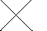

<?
<body>
  
  

    

      

      

      <h3><a name="0">NAME</a></h3>
      <blockquote>
        <b>move2(3f)</b> - [M_draw:MOVE] Move graphics position to point (x, y) <b></b>
      </blockquote>
      <h3><a name="5">SYNOPSIS</a></h3>
      <blockquote>
        <pre>
subroutine <b>move2</b>(<i>x</i>, <i>y</i>)
<b>real,intent</b>(<i>in</i>) :: <i>x</i>, <i>y</i>
</pre>
      </blockquote>
      <h3><a name="2">DESCRIPTION</a></h3>
      <blockquote>
        
Update current position. Move graphics position to point (<i>x</i>, <i>y</i>). (<i>x</i>, <i>y</i>) is a point <i>in</i> world coordinates.

      </blockquote>
      <h3><a name="3">OPTIONS</a></h3>
      <blockquote>
        <table cellpadding="3">
          <tr valign="top">
            <td class="c217" width="6%" nowrap="nowrap">X</td>
            <td valign="bottom">new X position</td>
          </tr>
          <tr valign="top">
            <td class="c217" width="6%" nowrap="nowrap">Y</td>
            <td valign="bottom">new Y position</td>
          </tr>
        </table>
      </blockquote>
      <h3><a name="4">EXAMPLE</a></h3>
      <blockquote>
        Sample program:
        <pre>
     program demo_move2
     use M_draw, only : prefsize, vinit, ortho2, clear, getkey
     use M_draw, only : move2, draw2, vexit, color
     use M_draw,    only  : D_BLACK,   D_WHITE
     use M_draw,    only  : D_RED,     D_GREEN,    D_BLUE
     use M_draw,    only  : D_YELLOW,  D_MAGENTA,  D_CYAN
     implicit none
     integer :: ipaws
     call prefsize(60,40)
     call vinit(' ') ! start graphics using device $M_DRAW_DEVICEDEVICE
     call ortho2(-300.0,300.0,-200.0,200.0)
     call color(D_BLACK)
     call clear()
     call color(D_WHITE)
     call move2(-300.0,-200.0)
     call draw2(300.0,200.0)
     call move2(300.0,-200.0)
     call draw2(-300.0,200.0)
     ipaws=getkey()
     call vexit()
     end program demo_move2
 
</pre>
      </blockquote>
      

       
      

    

  

</body>
