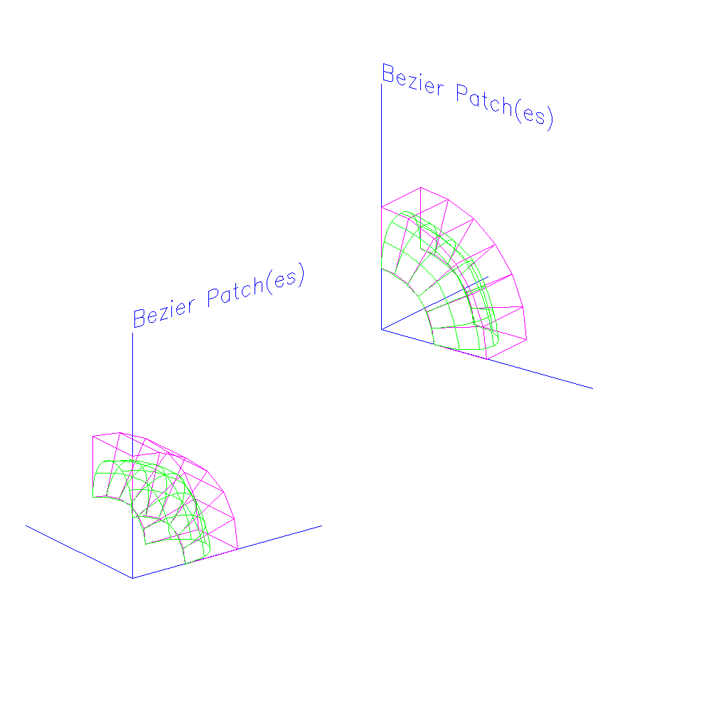

<?
<body>
  
  

    

      

      

      <h3><a name="0">NAME</a></h3>
      <blockquote>
        <b>patch(3f)</b> - [M_draw:PATCH] Draws a patch in the current basis, according to the geometry matrices gx, gy, and gz. <b></b>
      </blockquote>
      <h3><a name="4">SYNOPSIS</a></h3>
      <blockquote>
        <pre>
subroutine <b>patch</b>(<i>gx</i>, <i>gy</i>, <i>gz</i>)
<b>real,intent</b>(<i>in</i>) :: <i>gx</i>(4,4), <b>gy</b>(4,4), <i>gz</i>(4,4)
</pre>
      </blockquote>
      <h3><a name="2">DESCRIPTION</a></h3>
      <blockquote>
        
Draws a patch <i>in</i> the current basis, according to the geometry matrices <i>gx</i>, <i>gy</i>, and <i>gz</i>.

      </blockquote>
      <h3><a name="3">EXAMPLE</a></h3>
      <blockquote>
        Sample program:
        <pre>
   program demo_patch
   !     Draws patches of various bases
   !
      use M_draw
      implicit none
   !
      character(len=20) :: dev
      integer           :: ios
      integer           :: i
      integer           :: idum
   !
   !  patch basis types
   !
      real bezier(4,4), cardinal(4, 4), bspline(4, 4)
      real power(4, 4)
      real x1(4, 4), y1(4, 4), z1(4, 4)
      real x2(4, 4), y2(4, 4), z2(4, 4)
     !
      character(len=50) :: labels(4)
     !
      real    basis(64)
      equivalence (basis(1), bezier(1, 1))
      equivalence (basis(17), cardinal(1, 1))
      equivalence (basis(33), bspline(1, 1))
      equivalence (basis(49), power(1, 1))
     !
      data bezier/                                            &amp;
      &amp;          -1.0,   3.0,    -3.0,   1.0,                 &amp;
      &amp;          3.0,    -6.0,   3.0,    0.0,                 &amp;
      &amp;          -3.0,   3.0,    0.0,    0.0,                 &amp;
      &amp;          1.0,    0.0,    0.0,    0.0/
     !
      data cardinal/                                          &amp;
      &amp;          -0.5,   1.5,    -1.5,   0.5,                 &amp;
      &amp;          1.0,    -2.5,   2.0,    -0.5,                &amp;
      &amp;          -0.5,   0.0,    0.5,    0.0,                 &amp;
      &amp;          0.0,    1.0,    0.0,    0.0/
     !
      data bspline/                                           &amp;
      &amp;          -0.166666,     0.5,     -0.5,     0.166666,  &amp;
      &amp;           0.5,         -1.0,      0.5,     0.0,       &amp;
      &amp;          -0.5,          0.0,      0.5,     0.0,       &amp;
      &amp;           0.166666,     0.666666, 0.166666, 0.0 /
     !
      data power/                                             &amp;
      &amp;          1.0, 0.0, 0.0, 0.0,                          &amp;
      &amp;          0.0, 1.0, 0.0, 0.0,                          &amp;
      &amp;          0.0, 0.0, 1.0, 0.0,                          &amp;
      &amp;          0.0, 0.0, 0.0, 1.0/
     !
      data    x1 /                                            &amp;
      &amp;          0.0,   0.2588,   0.5,   0.7071,              &amp;
      &amp;          0.0,   0.51764,  1.0,   1.4142,              &amp;
      &amp;          0.0,   0.51764,  1.0,   1.4142,              &amp;
      &amp;          0.0,   0.2588,   0.5,   0.7071/
     !
      data    y1 /                                            &amp;
      &amp;          1.0,   0.966,   0.866,  0.7071,              &amp;
      &amp;          2.0,   1.9318,  1.732,  1.4142,              &amp;
      &amp;          2.0,   1.9318,  1.732,  1.4142,              &amp;
      &amp;          1.0,   0.966,   0.866,  0.7071/
     !
      data    z1 /                                            &amp;
      &amp;          1.0,   1.0,     1.0,    1.0,                 &amp;
      &amp;          1.0,   1.0,     1.0,    1.0,                 &amp;
      &amp;          0.0,   0.0,     0.0,    0.0,                 &amp;
      &amp;          0.0,   0.0,     0.0,    0.0/
     !
      data    x2 /                                            &amp;
      &amp;          0.7071, 0.8660, 0.9660, 1.0,                 &amp;
      &amp;          1.4142, 1.7320, 1.932,  2.0,                 &amp;
      &amp;          1.4142, 1.7320, 1.932,  2.0,                 &amp;
      &amp;          0.7071, 0.8660, 0.9660, 1.0/
     !
      data    y2 /                                            &amp;
      &amp;          0.7071, 0.5,    0.2588, 0.0,                 &amp;
      &amp;          1.4142, 1.0,    0.5176, 0.0,                 &amp;
      &amp;          1.4142, 1.0,    0.5176, 0.0,                 &amp;
      &amp;          0.7071, 0.5,    0.2588, 0.0/
     !
      data    z2 /                                            &amp;
      &amp;          1.0,   1.0,     1.0,    1.0,                 &amp;
      &amp;          1.0,   1.0,     1.0,    1.0,                 &amp;
      &amp;          0.0,   0.0,     0.0,    0.0,                 &amp;
      &amp;          0.0,   0.0,     0.0,    0.0/
     !
      data labels /                                           &amp;
      &amp;          'Bezier Patch(es)',                          &amp;
      &amp;          'Cardinal Patch(es)',                        &amp;
      &amp;          'B-Spline Patch(es)',                        &amp;
      &amp;          '''Power'' Patch(es)' /
   !
   !  demonstrate patches
   !
      write (*,*)'Enter device:'
      read(*,'(a)',iostat=ios) dev
      if(ios.ne.0)dev=' '
   !
      call prefsize(1000,1000)
      call vinit(dev)
   !
      call vsetflush(.true.)
   !
      call color(D_BLACK)
      call clear()
   !
   ! Set up two viewports (They actually overlap)
   !
      call viewport(-1.0, 0.3, -1.0, 0.3)
      call ortho(-2.0, 5.0, -2.0, 5.0, -2.0, 5.0)
      call lookat(0.0, 0.0, 0.0, -3.0, 2.0, -4.0, 0.0)
   !
   !       Save it
   !
      call pushviewport()
      call pushmatrix()
   !
      call viewport(-0.3, 1.0, -0.3, 1.0)
      call ortho(-2.0, 5.0, -2.0, 5.0, -2.0, 5.0)
      call lookat(0.0, 0.0, 0.0, 3.0, 2.0, -4.0, 0.0)
   !
      call textsize(0.4, 0.4)
   !
   !  patchcurves provides a number of curves in the t and u
   !  directions. patchprecision gives the minimum number of line
   !  segments making up the curves in the t and u directions. The
   !  actual number of linesegments in t or u is equal to the closest
   !  integer multiple of the number of curves, &gt; nsegs, in t or u,
   !  greater than or equal to the number set by patchprecision in u or
   !  t. eg. curves in t will be made up of 21 line segments so that we
   !  can match up the 7 curves in u; curves in u will have 24 as 4 by 5
   !  gives 20.
   !
      call patchcurves(4, 7)
      call patchprecision(20, 20)
   !
      do 10 i = 0, 3
   !
         call axes()
   !
   !     patchbasis sets the basis matrices for the t and u
   !     functions
   !
   !
         call patchbasis(basis(i*16 + 1), basis(i*16 + 1))
   !
   !               Draw with viewport 2
   !
         call move(0.0, 4.0, 0.0)
         call drawstr(labels(i+1))
   !
   !     Now draw the patches according to the geometry matrices in
   !     x1, y1, and z1, x2, y2, z2.
   !
         call drawhull(x1, y1, z1)
         call patch(x1, y1, z1)
   !
         call drawhull(x2, y2, z2)
         call patch(x2, y2, z2)
   !
   !               Now with viewport 1
   !
         call popviewport()
         call popmatrix()
   !
         call axes()
   !
         call move(0.0, 4.0, 0.0)
         call drawstr(labels(i + 1))
   !
   !     now draw the patches according to the geometry matrices in
   !     x1, y1, and z1, x2, y2, z2.
   !
         call drawhull(x1, y1, z1)
         call patch(x1, y1, z1)
   !
         call drawhull(x2, y2, z2)
         call patch(x2, y2, z2)
   !
         idum=getkey()
   !
   !     Save viewport 1 again and reset to viewport 2
   !
         call pushviewport()
         call pushmatrix()
   !
         call viewport(-0.3, 1.0, -0.3, 1.0)
         call ortho(-1.5, 5.0, -1.5, 5.0, -1.5, 5.0)
         call lookat(0.0, 0.0, 0.0, 3.0, 2.0, -4.0, 0.0)
   !
         call color(D_BLACK)
         call clear()
   10 continue
   !
      call vexit()
   !
   contains
   !
      subroutine drawhull(x, y, z)
      implicit none
   !
      real    x(4,4), y(4,4), z(4,4)
      integer :: i
      integer :: j
   !
         call color(D_MAGENTA)
         do i = 1,4
            call move(x(i,1), y(i,1), z(i,1))
            do j = 1,4
               call draw(x(i,j), y(i,j), z(i,j))
            enddo
         enddo
   !
         do i = 1,4
            call move(x(1,i), y(1,i), z(1,i))
            do j = 1,4
               call draw(x(j,i), y(j,i), z(j,i))
            enddo
         enddo
   !
         call color(D_GREEN)
      end subroutine drawhull
   !
      subroutine axes()
   !
   !       draw the axes
   !
         call color(D_BLUE)
         call move(0.0, 0.0, 0.0)
         call draw(4.0, 0.0, 0.0)
          call move(0.0, 0.0, 0.0)
         call draw(0.0, 4.0, 0.0)
          call move(0.0, 0.0, 0.0)
         call draw(0.0, 0.0, 4.0)
   !
      end subroutine axes
   !
   end program demo_patch
 
</pre>
      </blockquote>
      

       
      

    

  

</body>
