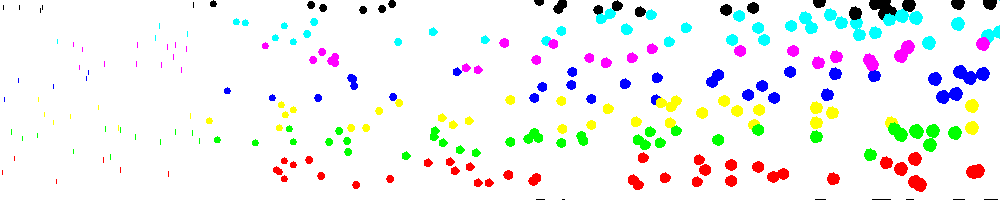

<?
<body>
  
  

    

      

      

      <h3><a name="0">NAME</a></h3>
      <blockquote>
        <b>point(3f)</b> - [M_draw:POINT] Draw a point at x, y, z <b></b>
      </blockquote>
      <h3><a name="4">SYNOPSIS</a></h3>
      <blockquote>
        <pre>
subroutine <b>point</b>(<i>x</i>, <i>y</i>, <i>z</i>)
<b>real,intent</b>(<i>in</i>) :: <i>x</i>, <i>y</i>, <i>z</i>
</pre>
      </blockquote>
      <h3><a name="2">DESCRIPTION</a></h3>
      <blockquote>
        Draw a point at <i>x</i>, <i>y</i>, <i>z</i>. The size of the point is not affected by perspective. Draw a polygon if you want perspective to be
        applied. The size of the point is controlled by the current linewidth.
      </blockquote>
      <h3><a name="3">EXAMPLE</a></h3>
      <blockquote>
        Sample program:
        <pre>
   program demo_point
   use M_draw
   use M_draw,    only  : D_BLACK,   D_WHITE
   use M_draw,    only  : D_RED,     D_GREEN,    D_BLUE
   use M_draw,    only  : D_YELLOW,  D_MAGENTA,  D_CYAN
   implicit none
   integer :: i
   integer :: ikey
      call prefsize(1000,200)
      call vinit(' ')
      call color(D_BLACK)
      call clear()
      call page(-25.0, 25.0, -5.0, 5.0)
       ! draw points using various linewidths and colors
      do i=1,300
         call randpoint()
      enddo
       ikey=getkey()
      call vexit()
    contains
      subroutine randpoint()
         real :: r1, r2
         call random_number(r1)
         call random_number(r2)
         call linewidth(int(r1*500+200))
         call color(nint(r2*7))
         call point(r1*50.0-25.0,r2*10.0-5.0,0.0)
      end subroutine randpoint
    end program demo_point
 
</pre>
      </blockquote>
      

       
      

    

  

</body>
