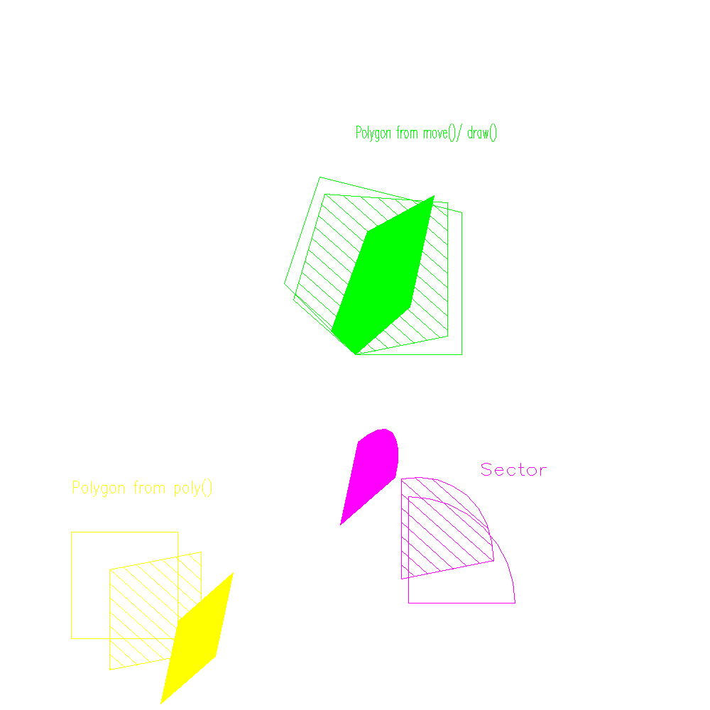

<?
<body>
  
  

    

      

      

      <h3><a name="0">NAME</a></h3>
      <blockquote>
        <b>poly(3f)</b> - [M_draw:POLYGONS] Construct a polygon from an array of points <b></b>
      </blockquote>
      <h3><a name="4">SYNOPSIS</a></h3>
      <blockquote>
        <pre>
subroutine <b>poly</b>(<i>n</i>, <i>points</i>)
<b>integer,intent</b>(<i>in</i>) :: <i>n</i>
<b>real,intent</b>(<i>in</i>) :: <b>points</b>(<i>3</i>, <i>n</i>)
</pre>
      </blockquote>
      <h3><a name="2">DESCRIPTION</a></h3>
      <blockquote>
        
Construct a polygon from an array of <i>points</i> provided by the user.

      </blockquote>
      <h3><a name="3">EXAMPLE</a></h3>
      <blockquote>
        Sample program:
        <pre>
   program demo_poly
   use M_draw
   ! Using polygons, hatching, and filling.
   integer           :: ios
   character(len=50) :: device
      print*,'Enter output device:'
      read(*,'(a)',iostat=ios)device
      if(ios.ne.0)then
         call prefsize(1000,1000)
         device=' '
      endif
      call vinit(device)
   ! clear to black
      call color(D_BLACK)
      call clear()
   ! world coordinates are now in the range -10 to 10
   ! in x, y, and z. Note that positive z is towards us.
      call ortho(-10.0, 10.0, -10.0, 10.0, 10.0, -10.0)
      call color(D_YELLOW)
   ! write out the string "Polygon from poly()" in the
   ! starting at (-8.0, -4.0) and scaled to be 4.0 units long,
   ! 0.5 units high.
      call boxtext(-8.0, -4.0, 4.0, 0.5, 'Polygon from poly()')
      call color(D_GREEN)
   ! write out a scaled string starting at (0.0, 6.0)
      call boxtext(0.0, 6.0, 4.0, 0.5, 'Polygon from move()/ draw()')
      call color(D_MAGENTA)
   ! write out a scaled string starting at (0.0, 6.0)
      call boxtext(3.5, -3.5, 1.9, 0.5, 'Sector')
   ! draw some polygons
      call drawpoly()
   ! turn on polygon hatching
      call polyhatch(.true.)
      call hatchang(45.0)
      call hatchpitch(0.3)
   !  Rotate 20 degrees around x and 30 around y
      call rotate(20.0, 'x')
      call rotate(30.0, 'y')
   ! draw some polygons with hatching
      call drawpoly()
   ! turn on polygon filling - this automatically turns off hatching
      call polyfill(.true.)
   !  Do another set of rotations.
      call rotate(20.0, 'x')
      call rotate(30.0, 'y')
   ! draw some polygons with filling
      call drawpoly()
      call vexit()
   contains
   subroutine drawpoly()
      real parray(3,4)                   ! An array of points for a polygon
      data parray/ -8.0, -8.0, 0.0,  &amp;
                 &amp; -5.0, -8.0, 0.0,  &amp;
                 &amp; -5.0, -5.0, 0.0,  &amp;
                 &amp; -8.0, -5.0, 0.0 /
      call color(D_YELLOW)
   ! Draw a polygon using poly, parray is our array of
   ! points and 4 is the number of points in it.
      call poly(4, parray)
      call color(D_GREEN)
   ! Draw a 5 sided figure by using move, draw and closepoly.
      call makepoly()
         call move(0.0, 0.0, 0.0)
         call draw(3.0, 0.0, 0.0)
         call draw(3.0, 4.0, 0.0)
         call draw(-1.0, 5.0, 0.0)
         call draw(-2.0, 2.0, 0.0)
      call closepoly()
      call color(D_MAGENTA)
   ! draw a sector representing a 1/4 circle
      call sector(1.5, -7.0, 3.0, 0.0, 90.0)
      idum=getkey()
   end subroutine drawpoly
    end program demo_poly
 
</pre>
      </blockquote>
      

       
      

    

  

</body>
