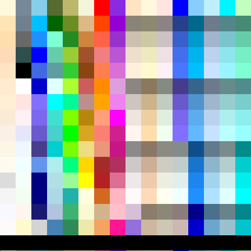

<?
<body>
  
  

    

      

      

      <h3><a name="0">NAME</a></h3>
      <blockquote>
        <b>poly2(3f)</b> - [M_draw:POLYGONS] Construct an (x, y) polygon from an array of points <b></b>
      </blockquote>
      <h3><a name="4">SYNOPSIS</a></h3>
      <blockquote>
        <pre>
subroutine <b>poly2</b>(<i>n</i>, <i>points</i>)
<b>integer,intent</b>(<i>in</i>) :: <i>n</i>
<b>real,intent</b>(<i>in</i>) :: <b>points</b>(<i>2</i>, <i>n</i>)
</pre>
      </blockquote>
      <h3><a name="2">DESCRIPTION</a></h3>
      <blockquote>
        Construct an (x, y) polygon from an array of <i>points</i> provided by the user.
      </blockquote>
      <h3><a name="3">EXAMPLE</a></h3>
      <blockquote>
        Sample program:
        <pre>
   program demo_poly2
   use M_draw
   integer :: i,j
   real    :: xx,yy
      call prefsize(512,512)
      call vinit(' ') ! start graphics using device $M_DRAW_DEVICEDEVICE
      call ortho2(0.0,256.0,0.0,256.0)
      call linewidth(1)
      call polyfill(.true.)
      ! step thru a series of rectangular cells
      icolor=0
      xx=0.0
      do i=1,16
         yy=0.0
         do j=1,16
            yy=yy+16.0
            icolor=icolor+1
            call setcolor(icolor,xx,yy)
         enddo
         xx=xx+16.0
      enddo
      ipaws=getkey()
      call vexit()
   contains
    subroutine setcolor(iset,xx,yy)
   use M_strings, only : v2s
   use M_color,  only : color_name2rgb
   integer,intent(in) :: iset
   real,intent(in)    :: xx,yy
   character(len=80)  :: echoname
   real    :: points(2,100)
   if(iset.gt.255)return
   ! determine coordinates of next square
   points(1:2,1)=[xx,      yy      ]
   points(1:2,2)=[xx,      yy+16.0 ]
   points(1:2,3)=[xx+16.0, yy+16.0 ]
   points(1:2,4)=[xx+16.0, yy      ]
   points(1:2,5)=[xx,      yy      ]
   ! get some nice RGB values to try from named colors known by M_color module
   call color_name2rgb(v2s(icolor),red,green,blue,echoname)
   if(echoname.eq.'Unknown') return
   ! set a color number to the new RGB values
   write(*,*)icolor, nint(red*2.55), nint(green*2.55), nint(blue*2.55),trim(echoname)
   call mapcolor(icolor, nint(red*2.55), nint(green*2.55), nint(blue*2.55))
   ! set to the new color
   call color(icolor)
   ! fill the rectangle in that color
   call poly2(5,points)
   end subroutine setcolor
    end program demo_poly2
 
</pre>
      </blockquote>
      

       
      

    

  

</body>
