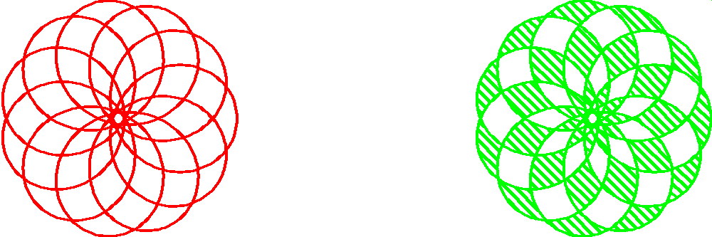

<?
<body>
  
  

    

      

      

      <h3><a name="0">NAME</a></h3>
      <blockquote>
        <b>polyhatch(3f)</b> - [M_draw:POLYGONS] Set the polygon hatch flag <b></b>
      </blockquote>
      <h3><a name="4">SYNOPSIS</a></h3>
      <blockquote>
        <pre>
subroutine <b>polyhatch</b>(<i>onoff</i>)
logical <i>onoff</i>
</pre>
      </blockquote>
      <h3><a name="2">DESCRIPTION</a></h3>
      <blockquote>
        
Set the polygon hatch flag. This will always turn off fill. A non-zero integer or LOGICAL .true. turns polyhatch on. Note that hatched polygons
        must initially be defined parallel to the X-Y plane.

      </blockquote>
      <h3><a name="3">EXAMPLE</a></h3>
      <blockquote>
        Sample program:
        <pre>
   program demo_polyhatch
   use M_draw
   use M_draw,    only  : D_BLACK,   D_WHITE
   use M_draw,    only  : D_RED,     D_GREEN,    D_BLUE
   use M_draw,    only  : D_YELLOW,  D_MAGENTA,  D_CYAN
   real :: N=11
   call prefsize(600*10/6,200*10/6)
   call vinit(' ')
   call page( -15.0, 15.0, -5.0, 5.0)
   call linewidth(100)
   call color(D_BLACK)
   call clear()
   call color(D_RED)
   call spirograph(-10.0, 0.0, N, 1.0, N, 5.0, 1000, 0.0, 0.0, 0)
   call polyhatch(.true.) ! turn on polygon hatching
   call hatchang(45.0)
   call hatchpitch(0.3)
   call color(D_GREEN)
   call spirograph(10.0, 0.0, N, 1.0, N, 5.0, 1000, 0.0, 0.0, 2)
   call vflush()
   key=getkey()
   call vexit()
   end program demo_polyhatch
</pre>
      </blockquote>
      

       
      

    

  

</body>
