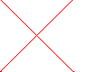

<?
<body>
  
  

    

      

      

      <h3><a name="0">NAME</a></h3>
      <blockquote>
        <b>prefsize(3f)</b> - [M_draw:WINDOW_SETUP] Specify preferred width and height of window in physical units <b></b>
      </blockquote>
      <h3><a name="5">SYNOPSIS</a></h3>
      <blockquote>
        <pre>
subroutine <b>prefsize</b>(<i>width</i>, <i>height</i>)
<b>integer,intent</b>(<i>in</i>) :: <i>width</i>, <i>height</i>
</pre>
      </blockquote>
      <h3><a name="2">DESCRIPTION</a></h3>
      <blockquote>
        
Specify the preferred <i>width</i> and <i>height</i> of the device output surface opened by the *next* <b>vinit</b>(3f).

      </blockquote>
      <h3><a name="3">OPTIONS</a></h3>
      <blockquote>
        <table cellpadding="3">
          <tr valign="top">
            <td class="c291" width="6%" nowrap="nowrap">WIDTH</td>
            <td valign="bottom"><i>width</i> of device to create when <b>vinit</b>(3f) is called</td>
          </tr>
          <tr valign="top">
            <td class="c291" width="6%" nowrap="nowrap">HEIGHT</td>
            <td valign="bottom"><i>height</i> of device to create when <b>vinit</b>(3f) is called</td>
          </tr>
        </table>
      </blockquote>
      <h3><a name="4">EXAMPLE</a></h3>
      <blockquote>
        Sample program:
        <pre>
     program demo_prefsize
     use M_draw, only: prefsize, vinit, ortho2, clear, getkey
     use M_draw, only: move2, draw2, vexit, color
     use M_draw,    only  : D_BLACK,   D_WHITE
     use M_draw,    only  : D_RED,     D_GREEN,    D_BLUE
     use M_draw,    only  : D_YELLOW,  D_MAGENTA,  D_CYAN
     implicit none
     integer :: ipaws
        ! make first file with one size
        call prefsize(60*2,40*2)
        call vinit(' ') ! start graphics using device $M_DRAW_DEVICEDEVICE
        call picture()
        ipaws=getkey()
        call vexit()
         ! make second file with another size
        call prefsize(60*3,40*3)
        call vinit(' ')
        call picture()
        ipaws=getkey()
        call vexit()
     contains
     subroutine picture
        call ortho2(-300.0,300.0,-200.0,200.0)
        call color(D_BLACK)
        call clear()
        call color(D_RED)
        call move2(-300.0,-200.0)
        call draw2(300.0,200.0)
        call move2(300.0,-200.0)
        call draw2(-300.0,200.0)
     end subroutine picture
     end program demo_prefsize
</pre>
      </blockquote>
      

       
      

    

  

</body>
