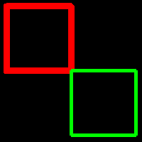

<?
<body>
  
  

    

      

      

      <h3><a name="0">NAME</a></h3>
      <blockquote>
        <b>rdraw2(3f)</b> - [M_draw:DRAW] Relative draw from current position to given point <b></b>
      </blockquote>
      <h3><a name="5">SYNOPSIS</a></h3>
      <blockquote>
        <pre>
subroutine <b>rdraw2</b>(<i>deltax</i>, <i>deltay</i>)
<b>real,intent</b>(<i>in</i>) :: <i>deltax</i>, <i>deltay</i>
</pre>
      </blockquote>
      <h3><a name="2">DESCRIPTION</a></h3>
      <blockquote>
        Relative draw from current position to specified point using current color and line width. Updates current position to new point. (x, y) is a point
        <i>in</i> world coordinates.
      </blockquote>
      <h3><a name="3">OPTIONS</a></h3>
      <blockquote>
        <i>deltax</i> and <i>deltay</i> are offsets <i>in</i> world units.
        <table cellpadding="3">
          <!-- tsb: <I>deltax</I> and <I>deltay</I> are offsets <I>in</I> world units.
 -->
          <tr valign="top">
            <td class="c316" width="6%" nowrap="nowrap">X</td>
            <td valign="bottom">new X position</td>
          </tr>
          <tr valign="top">
            <td class="c316" width="6%" nowrap="nowrap">Y</td>
            <td valign="bottom">new Y position</td>
          </tr>
        </table>
      </blockquote>
      <h3><a name="4">EXAMPLE</a></h3>
      <blockquote>
        Sample program:
        <pre>
     program demo_rdraw2
     use M_draw, only: vinit, prefsize, ortho2,linewidth,getkey
     use M_draw, only: clear, move2, rdraw2, vexit,color
     use M_draw,    only  : D_BLACK,   D_WHITE
     use M_draw,    only  : D_RED,     D_GREEN,    D_BLUE
     use M_draw,    only  : D_YELLOW,  D_MAGENTA,  D_CYAN
     integer :: ipaws
      call prefsize(200,200)
     call vinit(' ') ! start graphics using device $M_DRAW_DEVICEDEVICE
     call ortho2(-55.0, 55.0, -55.0, 55.0)
     call linewidth(400)
     call color(D_WHITE)
     call clear()
      call color(D_RED)
     call move2(-50.0,0.0)
     call square(50.0)
      call linewidth(200)
     call color(D_GREEN)
     call move2(  0.0,-50.0)
     call square(50.0)
      ipaws=getkey()
     call vexit()
      contains
      subroutine square(side)
     call rdraw2( side,   0.0)
     call rdraw2(  0.0,  side)
     call rdraw2(-side,   0.0)
     call rdraw2(  0.0, -side)
     end subroutine square
      end program demo_rdraw2
 
</pre>
      </blockquote>
      

       
      

    

  

</body>
