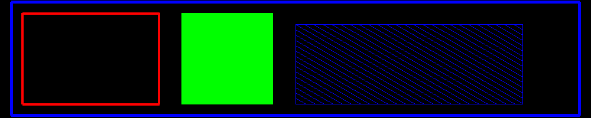

<?
<body>
  
  

    

      

      

      <h3><a name="0">NAME</a></h3>
      <blockquote>
        <b>rect(3f)</b> - [M_draw:POLYGONS] Draw a rectangle given two corners <b></b>
      </blockquote>
      <h3><a name="5">SYNOPSIS</a></h3>
      <blockquote>
        <pre>
subroutine <b>rect</b>(<i>x1</i>, <i>y1</i>, <i>x2</i>, <i>y2</i>)
<b>real,intent</b>(<i>in</i>) :: <i>x1</i>,<i>y1</i>,<i>x2</i>,<i>y2</i>
</pre>
      </blockquote>
      <h3><a name="2">DESCRIPTION</a></h3>
      <blockquote>
        Draw rectangle given two opposite corners.
        
Note: rectangles are regarded as polygons, so if polyfill or polyhatch has been called with .TRUE., the rectangle will be filled or hatched
        accordingly.

      </blockquote>
      <h3><a name="3">OPTIONS</a></h3>
      <blockquote>
        Given
        <pre>
      x1,y1 ############ x2,y1
            #          #
            #          #
            #          #
      x1,y2 ############ x2,y2
 
</pre>
        <blockquote>
          <table cellpadding="3">
            <tr valign="top">
              <td class="c320" width="6%" nowrap="nowrap">X1,Y1</td>
              <td valign="bottom">coordinates of a corner of the rectangle</td>
            </tr>
            <tr valign="top">
              <td class="c320" width="6%" nowrap="nowrap">X2,Y2</td>
              <td valign="bottom">coordinates of corner point opposite first point</td>
            </tr>
          </table>
        </blockquote>
      </blockquote>
      <h3><a name="4">EXAMPLE</a></h3>
      <blockquote>
        Sample program:
        <pre>
   program demo_rect
   use M_draw
   use M_draw,    only  : D_BLACK,   D_WHITE
   use M_draw,    only  : D_RED,     D_GREEN,    D_BLUE
   use M_draw,    only  : D_YELLOW,  D_MAGENTA,  D_CYAN
   implicit none
   integer :: ipaws
   real    :: b=0.2
    !! set up graphics area
   call prefsize(1000,200)
   call vinit(' ') ! start graphics using device $M_DRAW_DEVICEDEVICE
   call page(-25.0-b, 25.0+b, -5.0-b, 5.0+b)
    call linewidth(150)
   call color(D_RED)
   call rect(-24.0, -4.0, -12.0, 4.0)
   call polyfill(.true.)
   call color(D_GREEN)
   call rect(-10.0, -4.0, -2.0, 4.0)
   call polyhatch(.true.)
   call hatchpitch(0.4)
   call hatchang(30.0)
   call linewidth(20)
   call color(D_BLUE)
   call rect(0.0, -4.0, 20.0, 3.0)
   call linewidth(200)
   call color(D_BLUE)
   call move2(-25.0, -5.0)
   call draw2(-25.0, 5.0)
   call draw2(25.0, 5.0)
   call draw2(25.0, -5.0)
   call draw2(-25.0, -5.0)
    !! pause
   call vflush()
   ipaws=getkey()
    !! wrap up graphics
   call vexit()
    end program demo_rect
 
</pre>
      </blockquote>
      

       
      

    

  

</body>
