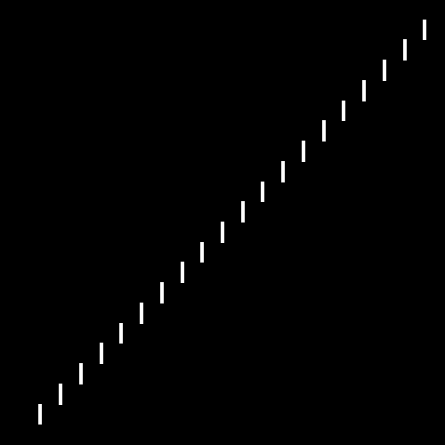

<?
<body>
  
  

    

      

      

      <h3><a name="0">NAME</a></h3>
      <blockquote>
        <b>rmove2(3f)</b> - [M_draw:MOVE] Relative move in world units. <b></b>
      </blockquote>
      <h3><a name="5">SYNOPSIS</a></h3>
      <blockquote>
        <pre>
subroutine <b>rmove2</b>(<i>deltax</i>, <i>deltay</i>)
<b>real,intent</b>(<i>in</i>) :: <i>deltax</i>, <i>deltay</i>
</pre>
      </blockquote>
      <h3><a name="2">DESCRIPTION</a></h3>
      <blockquote>
        Update current position. Relative move2. <i>deltax</i> and <i>deltay</i> are offsets <i>in</i> world units.
      </blockquote>
      <h3><a name="3">OPTIONS</a></h3>
      <blockquote>
        <table cellpadding="3">
          <tr valign="top">
            <td class="c330" width="6%" nowrap="nowrap">X</td>
            <td valign="bottom">new X position</td>
          </tr>
          <tr valign="top">
            <td class="c330" width="6%" nowrap="nowrap">Y</td>
            <td valign="bottom">new Y position</td>
          </tr>
        </table>
      </blockquote>
      <h3><a name="4">EXAMPLE</a></h3>
      <blockquote>
        Sample program:
        <pre>
     program demo_rmove2
     use M_draw, only: prefsize, vinit, ortho2, clear, getkey
     use M_draw, only: move2, rmove2, rdraw2, vexit
     use M_draw, only: linewidth
     call prefsize(500,500)
     call vinit(' ') ! start graphics using device $M_DRAW_DEVICEDEVICE
     call ortho2(-110.0,110.0,-110.0,110.0)
     call move2(-100.0,-100.0)
     call linewidth(70)
     do i=1,20
        call rmove2(10.0, 0.0)
        call rdraw2( 0.0,10.0)
     enddo
     ipaws=getkey()
     call vexit()
     end program demo_rmove2
</pre>
      </blockquote>
      

       
      

    

  

</body>
