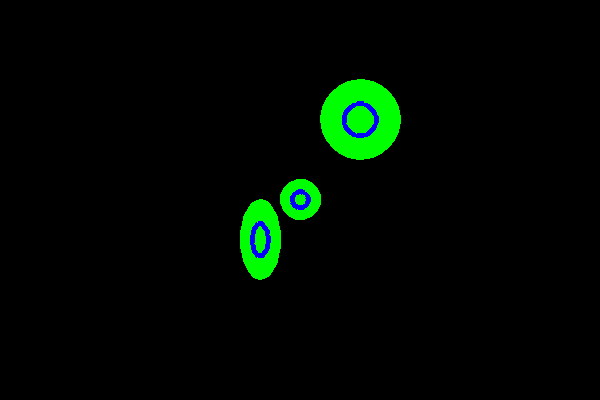

<?
<body>
  
  

    

      

      

      <h3><a name="0">NAME</a></h3>
      <blockquote>
        <b>saveobj(3f)</b> - [M_draw:OBJECT] Save object number n into file filename. Does NOT save objects called inside object n. <b></b>
      </blockquote>
      <h3><a name="4">SYNOPSIS</a></h3>
      <blockquote>
        <pre>
subroutine <b>saveobj</b>(<i>n</i>, <i>filename</i>)
<b>integer,intent</b>(<i>in</i>) :: <i>n</i>
<b>character</b>(len=*),intent(<i>in</i>) :: <i>filename</i>
</pre>
      </blockquote>
      <h3><a name="2">DESCRIPTION</a></h3>
      <blockquote>
        Save the object number <i>n</i> into the file <i>filename</i>. This call does not save objects called inside object <i>n</i>.
      </blockquote>
      <h3><a name="3">EXAMPLE</a></h3>
      <blockquote>
        Sample program:
        <pre>
   program demo_saveobj
   ! create object in file "circle.obj" for use with loadobj(3f)
   use M_draw
   use M_drawplus, only : invokeobj, pop, push
   implicit none
   character(len=:),allocatable :: env
   integer :: ipaws
   integer :: env_len
      call voutput('+')            ! ignore $M_DRAW_OUTPUT
      call vinit('nil')            ! start graphics
      call push()
      !
      call makeobj(3)              ! create an object
         call polyfill(.true.)
         call color(D_GREEN)
         call circle(0.0,0.0,10.0)
         call polyfill(.false.)
         call color(D_BLUE)
         call linewidth(100)
         call circle(0.0,0.0,4.0)
      call closeobj()
      !
      call saveobj(3,"circle.obj") ! save object to file
      call pop()
      call vexit()                 ! exit graphics
      !
      !-------  now this could be a separate program to use object
      !
      !------------------------------------------------------------
      ! CURRENTLY:
      ! with multiple vinit(3f) calls the environment variable is
      ! not used without explicitly using it
      call get_environment_variable('M_DRAW_OUTPUT',LENGTH=env_len)
      if(env_len.ne.0)then
         allocate(character(len=env_len) :: env)
         call get_environment_variable('M_DRAW_OUTPUT',env)
         call voutput(env)
      endif
      !------------------------------------------------------------
      call vinit(' ')  ! set up device
      call page(-100.0,100.0,-100.0,100.0)
      call loadobj(100,"circle.obj")
      ! translate x,y,z scale x,y,z rotate x,y,z object
      call invokeobj(   0.0,  0.0, 0.0,1.0,1.0,1.0,0.0,0.0,0.0, 100)
      call invokeobj( -20.0,-20.0, 0.0,1.0,2.0,1.0,0.0,0.0,0.0, 100)
      call invokeobj(  30.0, 40.0, 0.0,2.0,2.0,1.0,0.0,0.0,0.0, 100)
      ipaws=getkey()
      call vexit() ! set the screen back to its original state
      !
   end program demo_saveobj
 
</pre>
      </blockquote>
      

       
      

    

  

</body>
