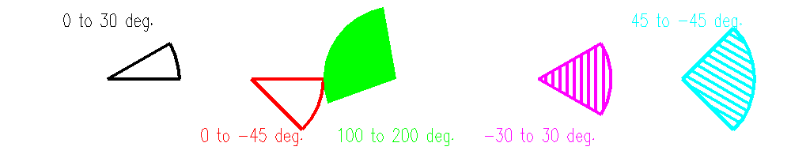

<?
<body>
  
  

    

      

      

      <h3><a name="0">NAME</a></h3>
      <blockquote>
        <b>sector(3f)</b> - [M_draw:ARCS] Draw a sector. Note: sectors are polygons. <b></b>
      </blockquote>
      <h3><a name="4">SYNOPSIS</a></h3>
      <blockquote>
        <pre>
subroutine <b>sector</b>(<i>x</i>, <i>y</i>, <i>radius</i>, <i>startang</i>, <i>endang</i>)
REAL <i>x</i>, <i>y</i>, <i>radius</i>, <i>startang</i>, <i>endang</i>
</pre>
      </blockquote>
      <h3><a name="2">DESCRIPTION</a></h3>
      <blockquote>
        
Draw a sector. <i>x</i>, <i>y</i>, and <i>radius</i> are values in world units. Note: sectors are regarded as polygons, so if polyfill or
        polyhatch has been called with 1, the sectors will be filled or hatched accordingly.

      </blockquote>
      <h3><a name="3">EXAMPLE</a></h3>
      <blockquote>
        Sample program:
        <pre>
   program demo_sector
   use M_draw
   use M_draw,    only  : D_BLACK,   D_WHITE
   use M_draw,    only  : D_RED,     D_GREEN,    D_BLUE
   use M_draw,    only  : D_YELLOW,  D_MAGENTA,  D_CYAN
   implicit none
   real           :: b=0.5
   real           :: R=4.9
   real           :: X, Y, A
   integer        :: key
      call prefsize(1000,200)
      call vinit(' ')
      call color(D_BLACK)
      call clear()
      call color(D_YELLOW)
      call page(-25.0-b, 25.0+b, -5.0-b, 5.0+b)
      call textsize(1.0,1.4)
      call font("futura.l")
      call centertext(.true.)
       ! draw sectors with various start and end angles
       call linewidth(150)
      call color(D_WHITE)
      X=-20; Y=0; R=5.0; A=0; B=30
      call sector(X,Y,R,A,B)
      call move2(X, 4.0)
      call linewidth(50)
      call drawstr("0 to 30 deg.")
       call linewidth(150)
      call color(D_RED)
      X=-10; Y=0; R=5; A=0; B=-45
      call sector(X,Y,R,A,B)
      call move2(X,-4.0)
      call linewidth(50)
      call drawstr("0 to -45 deg.")
       call polyfill(.true.)
       call linewidth(150)
      call color(D_GREEN)
      X=-0; Y=0; R=5; A=100; B=200
      call sector(X,Y,R,A,B)
      call move2(X,-4.0)
      call linewidth(50)
      call drawstr("100 to 200 deg.")
       call polyhatch(.true.)
      call hatchpitch(1.0/2.0)
      call hatchang(90.0)
       call linewidth(150)
      call color(D_MAGENTA)
      X=10; Y=0; R=5; A=-30; B=30
      call sector(X,Y,R,A,B)
      call move2(X,-4.0)
      call linewidth(50)
      call drawstr("-30 to 30 deg.")
       call hatchang(30.0)
      call linewidth(150)
      call color(D_CYAN)
      X=20; Y=0; R=5; A=45; B=-45
      call sector(X,Y,R,A,B)
      call move2(X, 4.0)
      call linewidth(50)
      call drawstr(" 45 to -45 deg.")
       key=getkey()
      call vexit()
   end program demo_sector
 
</pre>
      </blockquote>
      

       
      

    

  

</body>
