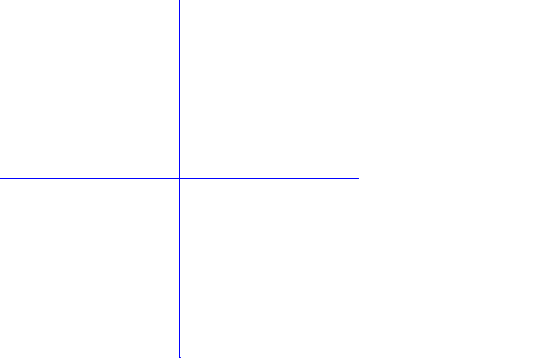

<?
<body>
  
  

    

      

      

      <h3><a name="0">NAME</a></h3>
      <blockquote>
        <b>slocator(3f)</b> - [M_draw:INTERACTIVE] Find out where cursor is in screen coordinates <b></b>
      </blockquote>
      <h3><a name="4">SYNOPSIS</a></h3>
      <blockquote>
        <pre>
integer function <b>slocator</b>(<i>xaddr</i>, <i>yaddr</i>)
real <i>xaddr</i>, <i>yaddr</i>
</pre>
      </blockquote>
      <h3><a name="2">DESCRIPTION</a></h3>
      <blockquote>
        
Find out where the cursor is. <i>xaddr</i> and <i>yaddr</i> are set to the current location in screen coordinates. The return value of the
        function is set up in the same way as with locator. If the device has no locator device slocator returns <b>-1</b>.

      </blockquote>
      <h3><a name="3">EXAMPLE</a></h3>
      <blockquote>
        Sample program:
        <pre>
    !
    !      a routine to demonstrate using locator.
    !
    program demo_slocator
     use M_draw
     character(len=20) :: dev
    integer bt
    real x, y, sx, sy
    logical act, curpnt
    integer :: ios
     print*,'Enter device name:'
    read(*,'(a)',iostat=ios) dev
    if(ios.ne.0)dev=' '
    call vinit(dev)
     call color(D_BLACK)
    call clear()
     call color(D_BLUE)
    !
    !       draw some axes
    !
    call move2(0.0, 1.0)
    call draw2(0.0, -1.0)
     call move2(1.0, 0.0)
    call draw2(-1.0, 0.0)
     call color(D_GREEN)
     act = .false.
    curpnt = .false.
    !
    !       locator returns whether a mouse button has been
    !       pressed or not. In a device such as the tektronix
    !       where you have to wait for a keypress to get the
    !       position of the crosshairs locator returns 0
    !       automatically on every second call. A return value
    !       of 2 indicates the second mouse button has been pressed.
    !       A return value of 1 indicates the first mouse button has
    !       been pressed. We wait for the locator to return zero so
    !       that we know the mouse button has been released.
    !
    write(*,*)' click two points to create a line segment'
    write(*,*)' button 2 exits'
     INFINITE: do
       bt = slocator(x, y)
       !! write(*,*)'slocator returned ',bt,' and coordinates ',x,y
       if (bt .eq. -1) then
          call vexit()
          print*,'No locator device found'
          stop
       elseif (bt .eq. 2) then
          call vexit()
          stop
       elseif (bt .eq. 0) then
          act = .true.
       elseif (act) then
          act = .false.
          if (bt .eq. 1) then
             if (curpnt) then
                call move2(sx, sy)
                call draw2(x, y)
                curpnt = .false.
             else
                curpnt = .true.
             endif
              sx = x
             sy = y
          endif
       endif
    enddo INFINITE
     end program demo_slocator
 
</pre>
      </blockquote>
      

       
      

    

  

</body>
