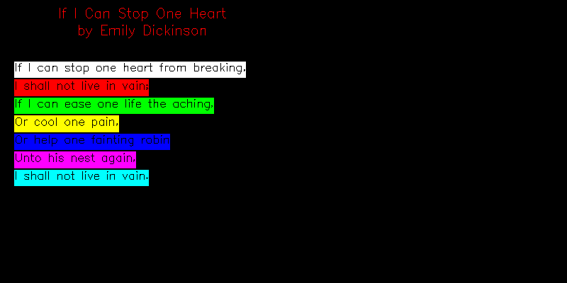

<?
<body>
  
  

    

      

      <h3><a name="0">NAME</a></h3>
      <blockquote>
        <b>strlength(3f)</b> - [M_draw:TEXT] return length of string <b></b>
      </blockquote>
      <h3><a name="5">SYNOPSIS</a></h3>
      <blockquote>
        <pre>
 <b>real</b> <i>function</i> <b>strlength</b>(string)
<b>character</b>(len=*),intent(in) :: <i>string</i>
</pre>
      </blockquote>
      <h3><a name="2">DESCRIPTION</a></h3>
      <blockquote>
        Return the length of the <i>string</i> "STRING" in world units.
      </blockquote>
      <h3><a name="3">RETURNS</a></h3>
      <blockquote>
        <table cellpadding="3">
          <tr valign="top">
            <td class="c375" colspan="1">STRLENGTH</td>
            <td>length of <i>string</i> using current font size</td>
          </tr>
        </table>
      </blockquote>
      <h3><a name="4">EXAMPLE</a></h3>
      <blockquote>
        Sample Program:
        <pre>
   program demo_strlength
   use :: M_draw
   use M_draw,    only  : D_BLACK,   D_WHITE
   use M_draw,    only  : D_RED,     D_GREEN,    D_BLUE
   use M_draw,    only  : D_YELLOW,  D_MAGENTA,  D_CYAN
   real    :: left
   real    :: baseline
   integer :: icolor=0
   real    :: texth=10.0
      !! set up drawing surface
      call prefsize(800, 400)
      call vinit(' ') ! start graphics using device $M_DRAW_DEVICEDEVICE
      call page(-100.0, 300.0, -100.0, 100.0)
      call color(D_WHITE)
      call clear()
      call linewidth(40)
      call textsize(texth, texth)
      call xcentertext()
      call color(D_RED)
       baseline=85.0
      call move2(0.0,baseline)
      call drawstr('If I Can Stop One Heart')
      baseline= baseline-texth*1.20
      call move2(0.0,baseline)
      call drawstr('by Emily Dickinson')
      call centertext(.false.)
       texth=8.5
      baseline=baseline-texth*1.50
      call textsize(texth, texth)
      left=-90.0
       call nextline('If I can stop one heart from breaking,')
      call nextline('I shall not live in vain;')
      call nextline('If I can ease one life the aching,')
      call nextline('Or cool one pain,')
      call nextline('Or help one fainting robin')
      call nextline('Unto his nest again,')
      call nextline('I shall not live in vain.')
       ipaws=getkey()
      call vexit()
   contains
   subroutine nextline(string)
   character(len=*) :: string
   real :: xx
   !! reduce some duplicate code; very specific to this EXAMPLE
      call color(icolor)
      baseline=baseline-texth*1.5    ! move down before drawing line
         call polyfill(.true.)
            call makepoly()
               xx=strlength(string)
               call rect(left,baseline-texth*0.3,left+xx,baseline+texth)
            call closepoly()
         call polyfill(.false.)
      call color(D_WHITE)
      call move2(left, baseline)
      call drawstr(string)    ! draw string
      icolor=icolor+1         ! set pen color
   end subroutine nextline
    end program demo_strlength
 
</pre>
      </blockquote>
      

       
      

    

  

</body>
