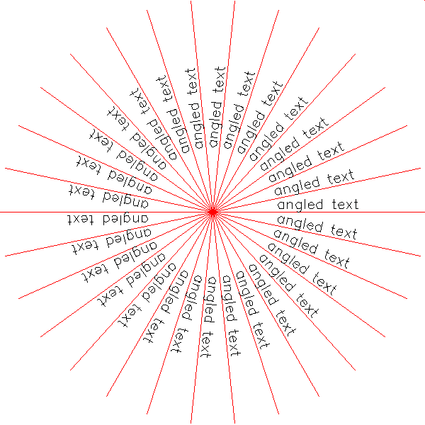

<?
<body>
  
  

    

      

      

      <h3><a name="0">NAME</a></h3>
      <blockquote>
        <b>textang(3f)</b> - [M_draw:TEXT] Set the SOFTWARE text angle. <b></b>
      </blockquote>
      <h3><a name="5">SYNOPSIS</a></h3>
      <blockquote>
        <pre>
subroutine <b>textang</b>(<i>ang</i>)
<b>real,intent</b>(<i>in</i>) :: <i>ang</i>
</pre>
      </blockquote>
      <h3><a name="2">DESCRIPTION</a></h3>
      <blockquote>
        Set the text angle. This angles strings and chars. This routine only affects software text. Angle is <i>in</i> degrees
      </blockquote>
      <h3><a name="3">OPTIONS</a></h3>
      <blockquote>
        <table cellpadding="3">
          <tr valign="top">
            <td class="c382" width="6%" nowrap="nowrap">ANG</td>
            <td valign="bottom">The angle <i>in</i> degrees to draw text with when using <b>drawstr</b>(3f). Angles are measured counterclockwise with zero
            degrees at the horizontal line to the right of the original.</td>
          </tr>
        </table>
      </blockquote>
      <h3><a name="4">EXAMPLE</a></h3>
      <blockquote>
        Sample program:
        <pre>
   program demo_textang
   use :: M_draw
   use :: M_units, only : cosd, sind
    !! set up drawing environment
   call prefsize(600,600)
   call vinit(' ') ! start graphics using device $M_draw_DEVICE
   call ortho2(-100.0,100.0,-100.0,100.0)
   call textsize(7.0,7.0)
   call linewidth(20)
   call color(D_BLACK)
   call clear()
    do i=1,30
      !! draw radial lines
      call color(D_RED)
      call move2(0.0,0.0)
      call draw2(100.0*cosd(i*12),100.0*sind(i*12))
      !! draw rotated text
      call color(D_WHITE)
      call move2(30.0*cosd(i*12),30.0*sind(i*12))
      call textang(i*12.0)
      call drawstr('angled text')
   enddo
    ipaws=getkey()
    call vexit()
    end program demo_textang
 
</pre>
      </blockquote>
      

       
      

    

  

</body>
