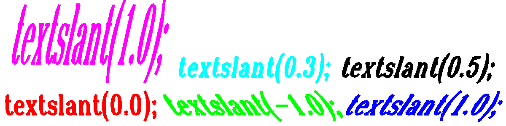

<?
<body>
  
  

    

      

      

      <h3><a name="0">NAME</a></h3>
      <blockquote>
        <b>textslant(3f)</b> - [M_draw:TEXT] Defines the obliqueness of the fonts. <b></b>
      </blockquote>
      <h3><a name="4">SYNOPSIS</a></h3>
      <blockquote>
        <pre>
subroutine <b>textslant</b>(<i>var</i>)
real <i>var</i>
</pre>
      </blockquote>
      <h3><a name="2">DESCRIPTION</a></h3>
      <blockquote>
        
Defines the obliqueness of the fonts. This is a simplistic method that allows you to generate italicized versions of the software fonts. The x-
        values of the software font coordinates after the current <b>textsize</b>() values are applied are multiplied by (1+val).

        
Note that this means the same value tilts the characters less the taller the characters are relative to their width.

        
Generally, practical values are generally between <b>-1</b> and 1 times the

      </blockquote>
      <h3><a name="3">EXAMPLE</a></h3>
      <blockquote>
        Sample program:
        <pre>
   program demo_textslant
   use M_draw
   implicit none
   real    :: x1, x2, y1, y2
   real    :: scl
   integer :: key
      call prefsize(1200,300)
      call vinit(' ')
      call color(D_BLACK)
      call clear()
      x1=0.0; x2=40.0; y1=0.0; y2=10.0; scl=3*0.7
      call page(x1,x2,y1,y2)
      call font("times.rb")
      call linewidth(180)
      call textsize(0.8*scl,1.2*scl)
      call move2( x1+.3,y1+.4)
      call color(D_RED); call textslant(0.0);  call drawstr("textslant(0.0); ")
      call color(D_GREEN); call textslant(-1.0); call drawstr(" textslant(-1.0);")
      call color(D_BLUE); call textslant(1.0);  call drawstr(" textslant(1.0);")
      call textsize(0.8*scl,1.2*3*scl)
      call move2(x1+.3,y1+3+.4)
      call color(D_MAGENTA); call textslant(1.0); call drawstr(" textslant(1.0);")
      call textsize(0.8*scl,1.2*scl)
      call color(D_CYAN); call textslant(0.3); call drawstr(" textslant(0.3);")
      call color(D_WHITE); call textslant(0.5); call drawstr(" textslant(0.5);")
      call vflush()
      key=getkey()
      call vexit()
   end program demo_textslant
 
</pre>
      </blockquote>
      

       
      

    

  

</body>
