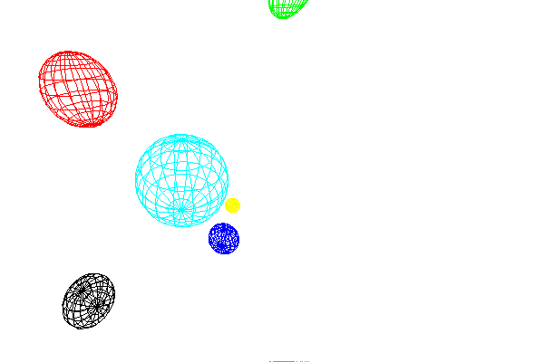

<?
<body>
  
  

    

      

      

      <h3><a name="0">NAME</a></h3>
      <blockquote>
        <b>translate(3f)</b> - [M_draw:TRANSFORMATION] Set up a translation. <b></b>
      </blockquote>
      <h3><a name="4">SYNOPSIS</a></h3>
      <blockquote>
        <pre>
subroutine <b>translate</b>(<i>x</i>, <i>y</i>, <i>z</i>)
real <i>x</i>, <i>y</i>, <i>z</i>
</pre>
      </blockquote>
      <h3><a name="2">DESCRIPTION</a></h3>
      <blockquote>
        
Set up a translation.

      </blockquote>
      <h3><a name="3">EXAMPLE</a></h3>
      <blockquote>
        Sample program:
        <pre>
   program demo_translate
   !
   !      a demonstration of objects
   !
   use M_draw
    integer SPHERE
   real RADIUS
   parameter (RADIUS = 10.0)
   parameter(SPHERE = 1)
   character(len=50) :: device
   integer           :: ios
    print*,'Enter output device:'
   read(*,'(a)',iostat=ios) device
   if(ios.ne.0)device=' '
    call vinit(device)
    call vsetflush(.false.)
   !
   ! set up our viewing transformation
   !
   call perspective(90.0, 1.0, 0.001, 500.0)
   call lookat(13.0, 13.0, 8.0, 0.0, 0.0, 0.0, 0.0)
    call color(D_BLACK)
   call clear()
   !
   ! Call a routine to make the sphere object
   !
   call makesphere()
    !
   ! Now draw the sphere object scaled down. We use the pushmatrix
   ! and the popmatrix to preserve the transformation matrix so
   ! that only this sphere is drawn scaled. The callobj then enables
   ! us to draw the sphere we generated with makeobj in makesphere.
   !
   call color(D_CYAN)
    call pushmatrix()
   call scale(0.5, 0.5, 0.5)
   call callobj(SPHERE)
   call popmatrix()
   !
   ! now we draw the same sphere translated, with a different
   ! scale and color.
   !
   call color(D_WHITE)
    call pushmatrix()
   call translate(0.0, (-1.4) * RADIUS, 1.4 * RADIUS)
   call scale(0.3, 0.3, 0.3)
   call callobj(SPHERE)
   call popmatrix()
   !
   ! and maybe a few more times....
   !
   call color(D_RED)
    call pushmatrix()
   call translate(0.0, RADIUS, 0.7 * RADIUS)
   call scale(0.2, 0.2, 0.2)
   call callobj(SPHERE)
   call popmatrix()
    call color(D_GREEN)
    call pushmatrix()
   call translate(0.0, 1.5 * RADIUS, -RADIUS)
   call scale(0.15, 0.15, 0.15)
   call callobj(SPHERE)
   call popmatrix()
    call color(D_YELLOW)
    call pushmatrix()
   call translate(0.0, -RADIUS, -RADIUS)
   call scale(0.12, 0.12, 0.12)
   call callobj(SPHERE)
   call popmatrix()
    call color(D_BLUE)
    call pushmatrix()
   call translate(0.0, (-2.0)*RADIUS, -RADIUS)
   call scale(0.3, 0.3, 0.3)
   call callobj(SPHERE)
   call popmatrix()
    idum=getkey()
    call vexit()
   contains
   subroutine makesphere
   !
   !        make a sphere object
   !
   integer SPHERE
   integer ii
   real i, r, z, a, RADIUS, PI
   parameter (PI = 3.1415926535, RADIUS = 10.0, SPHERE = 1)
    call makeobj(SPHERE)
   !
   ! create the latitudinal rings
   !
   do ii = 0, 180, 20
      call pushmatrix()
      i=real(ii)
      call rotate(i, 'y')
      call circle(0.0, 0.0, RADIUS)
      call popmatrix()
   enddo
   !
   ! create the longitudinal rings
   !
   call pushmatrix()
   call rotate(90.0, 'x')
   do ia = -90, 90, 20
      a=ia
      r = RADIUS * cos(a * PI / 180.0)
      z = RADIUS * sin(a * PI / 180.0)
      call pushmatrix()
      call translate(0.0, 0.0, -z)
      call circle(0.0, 0.0, r)
      call popmatrix()
   enddo
   call popmatrix()
    call closeobj()
    end subroutine makesphere
    end program demo_translate
</pre>
      </blockquote>
      

       
      

    

  

</body>
