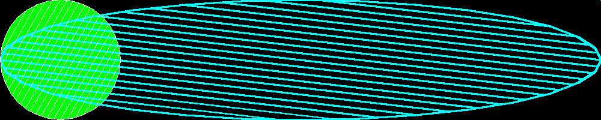

<?
<body>
  
  

    

      

      

      <h3><a name="0">NAME</a></h3>
      <blockquote>
        <b>unexpandviewport(3f)</b> - [M_draw:VIEWPORT] undo <b>expandviewport</b>(3f) <b></b>
      </blockquote>
      <h3><a name="4">SYNOPSIS</a></h3>
      <blockquote>
        <pre>
subroutine <b>unexpandviewport</b>()
</pre>
      </blockquote>
      <h3><a name="2">DESCRIPTION</a></h3>
      <blockquote>
        
Does the reverse of expandviewport. Basically, it returns M_draw to using the largest square of the device for its viewport calculations.

      </blockquote>
      <h3><a name="3">EXAMPLE</a></h3>
      <blockquote>
        Sample program:
        <pre>
   program demo_unexpandviewport
   use M_draw
   use M_draw,    only  : D_BLACK,   D_WHITE
   use M_draw,    only  : D_RED,     D_GREEN,    D_BLUE
   use M_draw,    only  : D_YELLOW,  D_MAGENTA,  D_CYAN
   implicit none
   integer :: ipaws
    !! set up graphics area
   call prefsize(1000,200)
   call vinit(' ') ! start graphics using device $M_DRAW_DEVICEDEVICE
    !! draw circle that fills default world coordinate window
   call polyfill(.true.)
   call color(D_GREEN)
   call circle(0.0,0.0,1.0)
   ipaws=getkey() !! pause
    !! set new scales for viewport so &lt;-1,-1&gt; and &lt;1,1&gt; are at
   !! corners of display instead of corners of largest square
   !! that can fit on display
   call expandviewport()
   call viewport(-1.0,1.0,-1.0,1.0)
    !! draw circle that fills default world coordinate window again
   !! instead of a circle, the mapping now produces an ellipse unless
   !! this device has a square display
   call polyhatch(.true.)
   call hatchpitch(0.1)
   call hatchang(30.0)
   call linewidth(40)
   call color(D_CYAN)
   call circle(0.0,0.0,1.0)
   ipaws=getkey() !! pause
    !! set new scales for viewport so &lt;-1,-1&gt; and &lt;1,1&gt; are at
   !! corners of largest square that fits on display
   call unexpandviewport()
   !! actually change to the new viewport
   call viewport(-1.0,1.0,-1.0,1.0)
    !! now the same circle should draw where the original one did
   call color(D_BLACK)
   call hatchang(120.0)
   call linewidth(40)
   call circle(0.0,0.0,1.0)
   ipaws=getkey() !! pause
    call vexit()                  !! wrap up graphics
    end program demo_unexpandviewport
</pre>
      </blockquote>
      

       
      

    

  

</body>
