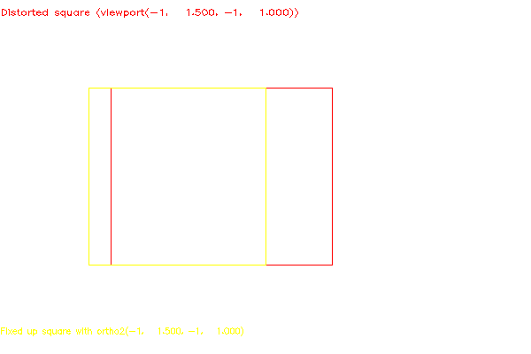

<?
<body>
  
  

    

      

      

      <h3><a name="0">NAME</a></h3>
      <blockquote>
        <b>viewport(3f)</b> - [M_draw:VIEWPORT] Specify which part of screen to draw in <b></b>
      </blockquote>
      <h3><a name="4">SYNOPSIS</a></h3>
      <blockquote>
        <pre>
subroutine <b>viewport</b>(<i>left</i>, <i>right</i>, <i>bottom</i>, <i>top</i>)
<b>real,intent</b>(<i>in</i>) :: <i>left</i>, <i>right</i>, <i>bottom</i>, <i>top</i>
</pre>
      </blockquote>
      <h3><a name="2">DESCRIPTION</a></h3>
      <blockquote>
        Specify which part of the screen to draw <i>in</i>. Left, <i>right</i>, <i>bottom</i>, and <i>top</i> are real values <i>in</i> screen coordinates
        (0:n,0:m).
        
If a device has been declared to be 600 x 400

        <pre>
        o-----&gt; X                         (right=600,top=0)
        | #------------------------------------#
        | |                                    |
        | |                                    |
        V |                                    |
        Y |                                    |
          #------------------------------------#
</pre>(<i>left</i>=0,<i>bottom</i>=400)
      </blockquote>
      <h3><a name="3">EXAMPLE</a></h3>
      <blockquote>
        Sample program:
        <pre>
   program demo_viewport
   !
   ! using non-square viewports, the associated distortion -- and how to fix it
   !
   use M_draw
    character(len=50)  :: device
   character(len=120) :: buf
   real    xfact, yfact
   integer :: ios
    print*,'Enter output device:'
   read(*,'(a)',iostat=ios)device
   if(ios.ne.0)device=' '
    call vinit(device)
    call color(D_BLACK)
   call clear()
   !
   ! Make the viewport the same size as the screen/window.
   !
   call getfactors(xfact, yfact)
   call viewport(-1.0, xfact, -1.0, yfact)
   !
   ! Draw a square. (Looks like a rectangle, if the viewport
   ! wasn't "accidentally" square)
   !
   call color(D_RED)
   call rect(-0.5, -0.5, 0.5, 0.5)
   !
   ! Tell them what it is.
   !
   call move2(-1.0, 0.9)
   write(buf,'(''Distorted square (viewport(-1, '', F7.3, '', -1, '', F7.3, ''))'')') xfact, yfact
   call drawstr(buf)
    idum=getkey()
   !
   ! Fix up the distortion (The actual formula to fix
   ! the distortion is (viewport.xmax * (1 + xfact) / 2.0),
   ! and similar for the y axis.
   !
   call ortho2(-1.0, xfact, -1.0, yfact)
   !
   ! Draw another square (Really is square this time)
   !
   call color(D_YELLOW)
   call rect(-0.5, -0.5, 0.5, 0.5)
   !
   ! Tell them what it is.
   !
   call move2(-1.0, -0.9)
   write(buf,'(''Fixed up square with ortho2(-1, '', F7.3, '', -1, '', F7.3, '')'')') xfact, yfact
   call drawstr(buf)
    idum=getkey()
   !
   ! Do it with world coords going from 0 - 5, 0 - 5.
   ! Reset square viewport.
   !
   call color(D_BLACK)
   call clear()
    call viewport(-1.0, 1.0, -1.0, 1.0)
   call ortho2(0.0, 5.0, 0.0, 5.0)
   call textsize(0.1, 0.1)
   !
   ! Square from 1 to 3. (Really is square)
   !
   call color(D_GREEN)
   call rect(1.0, 1.0, 3.0, 3.0)
    call move2(0.0, 4.5)
   call drawstr('Square from 0 - 3, 0 - 3')
    idum=getkey()
   !
   ! Distort it with a non-square viewport.
   !
   call viewport(-1.0, xfact, -1.0, yfact)
    call color(D_BLUE)
   call rect(1.0, 1.0, 3.0, 3.0)
    call move2(0.0, 0.5)
   call drawstr('Distorted square from 0 - 3, 0 - 3')
    idum=getkey()
   !
   ! Fix the distortion.
   !
   call ortho2(0.0, 5.0 * (1.0 + xfact) / 2.0, 0.0, 5.0 * (1.0 + yfact) / 2.0)
    call color(D_MAGENTA)
   call rect(1.0, 1.0, 3.0, 3.0)
    call move2(0.0, 2.5)
   call drawstr('Fixed up  square from 0 - 3, 0 - 3')
    idum=getkey()
    call vexit()
    end program demo_viewport
 
</pre>
      </blockquote>
      

       
      

    

  

</body>
