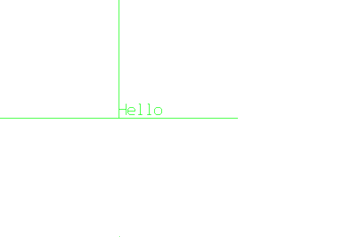

<?
<body>
  
  

    

      

      

      <h3><a name="0">NAME</a></h3>
      <blockquote>
        <b>vinit(3f)</b> - [M_draw:DEVICE] Initialise device <b></b>
      </blockquote>
      <h3><a name="5">SYNOPSIS</a></h3>
      <blockquote>
        <pre>
subroutine <b>vinit</b>(<i>device</i>)
<b>character</b>(len=*),intent(<i>in</i>) :: <i>device</i>
</pre>
      </blockquote>
      <h3><a name="2">DESCRIPTION</a></h3>
      <blockquote>
        Initialise the <i>device</i>.
      </blockquote>
      <blockquote>
        Note 1 : Currently available devices are:
      </blockquote>
      <h4><a name="">INTERACTIVE DEVICES</a></h4>
      <blockquote>
        <table cellpadding="3">
          <tr valign="top">
            <td class="c429" width="6%" nowrap="nowrap">PC</td>
            <td valign="bottom">- native MSW PC driver; only tested from CygWin</td>
          </tr>
          <tr valign="top">
            <td class="c429" width="6%" nowrap="nowrap">X11</td>
            <td valign="bottom">- X11 windows (Black background)</td>
          </tr>
          <tr valign="top">
            <td class="c429" width="6%" nowrap="nowrap">x11</td>
            <td valign="bottom">- X11 windows (White background)</td>
          </tr>
          <tr valign="top">
            <td class="c429" width="6%" nowrap="nowrap">tek</td>
            <td valign="bottom">- tektronix 4010 and compatibles xtek - X11 xterm Tektronix 4010 emulator</td>
          </tr>
        </table>
      </blockquote>
      <h4><a name="">PRINTERS AND PLOTTERS</a></h4>
      <blockquote>
        
PostScript: [p]psm or [p]postscript - monochrome PostScript [p]psg - grayscale PostScript [p]psc - color PostScript HPGL: hpgl - HP Graphics
        language and compatibles [p]hpgl2 - HPGL level 2 (obeys prefsize calls) PCL:

        <blockquote>
          <table cellpadding="3">
            <!-- tsb: PostScript:
 -->
            <tr valign="top">
              <td class="c429" colspan="1">[p]pclland</td>
              <td>- monochrome PCL5 (obeys prefsize calls)</td>
            </tr>
            <tr valign="top">
              <td class="c429" colspan="1">[p]pclport</td>
              <td>- monochrome PCL5 (obeys prefsize calls) pcl5land (color PCL5 landscape) pcl5port (color PCL5 portrait)</td>
            </tr>
          </table>
        </blockquote>
      </blockquote>
      
PIXMAPS (COLOR) AND BITMAPS (MONOCHROME)

      <blockquote>
        <table cellpadding="3">
          <!-- tsb: PIXMAPS (COLOR) AND BITMAPS (MONOCHROME)
 -->
          <tr valign="top">
            <td class="c429" width="6%" nowrap="nowrap">char</td>
            <td valign="bottom">An ASCII file that can be displayed to most <b>xterm</b>(1) terminal emulators that support color</td>
          </tr>
          <tr valign="top">
            <td class="c429" width="6%" nowrap="nowrap">p1/pbm</td>
            <td valign="bottom">Poskanzer (pbmplus/netplus) portable ASCII bitmap file</td>
          </tr>
          <tr valign="top">
            <td class="c429" width="6%" nowrap="nowrap">p3/ppm</td>
            <td valign="bottom">Poskanzer portable ASCII pixmap file</td>
          </tr>
          <tr valign="top">
            <td class="c429" width="6%" nowrap="nowrap">p4</td>
            <td valign="bottom">Poskanzer portable binary bitmap file</td>
          </tr>
          <tr valign="top">
            <td class="c429" width="6%" nowrap="nowrap">p6</td>
            <td valign="bottom">Poskanzer portable binary pixmap file</td>
          </tr>
          <tr valign="top">
            <td class="c429" width="6%" nowrap="nowrap">xbm</td>
            <td valign="bottom">X11 bitmap file</td>
          </tr>
          <tr valign="top">
            <td class="c429" width="6%" nowrap="nowrap">bm</td>
            <td valign="bottom">bitmap format for <b>atobm</b>(1)</td>
          </tr>
        </table>
      </blockquote>
      <h4><a name="">PRODUCT INPUT FILES</a></h4>
      <blockquote>
        <table cellpadding="3">
          <tr valign="top">
            <td class="c429" width="6%" nowrap="nowrap">mif</td>
            <td valign="bottom">FrameMaker Interchange Format 3.0 (MIF) files (16 colors)</td>
          </tr>
          <tr valign="top">
            <td class="c429" width="6%" nowrap="nowrap">mif4</td>
            <td valign="bottom">FrameMaker Interchange Format 4.0 (MIF) files (user-definable colors, but breaks a MIF rule)</td>
          </tr>
          <tr valign="top">
            <td class="c429" width="6%" nowrap="nowrap">xfig</td>
            <td valign="bottom">X11 <b>xfig</b>(1) figure utility</td>
          </tr>
          <tr>
            <td colspan="2">METAFILES WITH POST_PROCESSORS/CONVERTERS</td>
          </tr>
          <tr valign="top">
            <td class="c429" width="6%" nowrap="nowrap">cgmt</td>
            <td valign="bottom">a clear-text CGM (Computer Graphics Metafile)</td>
          </tr>
          <tr valign="top">
            <td class="c429" width="6%" nowrap="nowrap">gnu</td>
            <td valign="bottom">GNU <b>plot</b>(1) metafile</td>
          </tr>
          <tr valign="top">
            <td class="c429" width="6%" nowrap="nowrap">pdf</td>
            <td valign="bottom">Adobe Public Document Format</td>
          </tr>
          <tr valign="top">
            <td class="c429" colspan="2">unixplot</td>
          </tr>
          <tr valign="top">
            <td width="6%"></td>
            <td>Unix <b>plot</b>(1) metafile</td>
          </tr>
        </table>
      </blockquote>
      <h4><a name="">BROWSER FILES</a></h4>
      <blockquote>
        <table cellpadding="3">
          <tr valign="top">
            <td class="c429" width="6%" nowrap="nowrap">canvas</td>
            <td valign="bottom">HTML5 CANVAS graphics element file</td>
          </tr>
          <tr valign="top">
            <td class="c429" width="6%" nowrap="nowrap">svg</td>
            <td valign="bottom">Scalable Vector Graphics</td>
          </tr>
          <tr valign="top">
            <td class="c429" width="6%" nowrap="nowrap">usemap</td>
            <td valign="bottom">HTML image map</td>
          </tr>
          <tr valign="top">
            <td class="c429" width="6%" nowrap="nowrap">vml</td>
            <td valign="bottom">Microsoft Vector Markup Language</td>
          </tr>
        </table>
      </blockquote>
      <h4><a name="">FILES</a></h4>
      <blockquote>
        <table cellpadding="3">
          <tr valign="top">
            <td class="c429" width="6%" nowrap="nowrap">vog</td>
            <td valign="bottom">M_draw low level call record (debug)</td>
          </tr>
        </table>
      </blockquote>
      <h4><a name="">OTHER</a></h4>
      <blockquote>
        <table cellpadding="3">
          <tr valign="top">
            <td class="c429" width="6%" nowrap="nowrap">fti</td>
            <td valign="bottom">SGI vector-based icons</td>
          </tr>
          <tr valign="top">
            <td class="c429" width="6%" nowrap="nowrap">null</td>
            <td valign="bottom">no output</td>
          </tr>
        </table>
      </blockquote>
      
:- Drivers I've dropped but code is there for ---------------------------------------------

      <pre>
       grwin - (minGW GRwin PC interface)
       decX11 - the decstation window manager
       dxy - roland DXY plotter language
       sun - Sun workstations running sunview
       next - NeXTStep and other NeXT platforms
       apollo - Apollo workstations
 
</pre>
      <blockquote>
        :- Drivers I've dropped but are <i>in</i> the original distribution ------------------------------------------------------------
        <pre>
       hercules - IBM PC hercules graphics card
       cga - IBM PC cga graphics card
       ega - IBM PC ega graphics card
       vga - IBM PC vga graphics card
       sigma - IBM PC sigma graphics card.
       mswin - IBM PC Microsoft Windows.
 
</pre>
      </blockquote>Note 2 : If <i>device</i> is a NULL or a null string the value of the environment variable "M_DRAW_DEVICE" is taken as the <i>device</i>
      type to be opened. The format of the variable is
      <pre>
            M_DRAW_DEVICE [ xsize [ ysize [ xoffset [ yoffset ] ] ]
 
</pre>
      <blockquote>
        That is, if present xsize and ysize will be used <i>in</i> a call to <b>prefsize</b>(3c), and xoffset and yoffset will be used <i>in</i> a call to
        <b>preposition</b>(3c).
      </blockquote>
      
Note 3 : after <b>vinit</b>() it is wise to explicitly clear the screen. e.g.:

      <pre>
         call color(D_BLACK)
         call clear()
 
</pre>
      <h3><a name="3">NOTES</a></h3>
      <blockquote>
        
gnu

        <pre>
   The GNU plotutils package includes a program called plot(1) that
   can read in the gnu metafile and render images on an X11 display, PNG
   (Portable Network Graphics) format, portable anymap format (PBM/PGM/PPM),
   a pseudo-GIF format that does not use LZW encoding, the new XML-based
   Scalable Vector Graphics format, the format used by Adobe Illustrator,
   Postscript or Encapsulated Postscript (EPS) that can be edited with
   idraw(1), CGM format (by default, confirming to the WebCGM profile),
   the format used by the xfig(1) drawing editor, the Hewlett-Packard PCL 5
   printer language, the Hewlett-Packard Graphics Language, ReGIS graphics
   format (which can be displayed by the dxterm(1) terminal emulator or
   by a VT330 or VT340 terminal), Tektronix format (which can be displayed
   by the xterm(1) terminal emulator), and device-independent GNU metafile
   format itself.
 
</pre>pdf
        <pre>
   Popular PDF readers are the Adobe PDF viewer, which is often callable from
   Web browsers; the GhostScript-based gv(1) utility; or the xpdf program.
        The xpdf(1) software , related utilities ( pdftops(1), pdftotext(1),
       pdfinfo(1), pdffonts(1), pdftoppm(1), pdfimages(1), xpdfrc (5))
       and documentation are copyright 1996-2004 Glyph &amp; Cog, LLC. at
       <a href="http://www.foolabs.com/xpdf">http://www.foolabs.com/xpdf</a>/
 
</pre>
        <blockquote>
          The GhostScript-based tools can convert PDF files to PostScript as well as view the files.
        </blockquote>
        
cgmt

        <pre>
   The ralcgm(1) and gplot(1) packages are two very complete CGM viewers.
    ppm,pbm (and p1,p3,p4,p6)
      * p1/pbm - Poskanzer (pbmplus/netplus) portable ASCII bitmap file
     * p3/ppm - Poskanzer portable ASCII pixmap file
     * p4 - Poskanzer portable binary bitmap file
     * p6 - Poskanzer portable binary pixmap file
    The NetPBM package is available for almost every platform and lets
   you convert the Poskanzer portable pixmap (PPM) files to just about
   any pixmap or bitmap format, including PNG, JPEG, GIF/PseudoGIF, BPM,
   ..... Other popular pixmap products such as ImageMagick, gv, ... can
   read PPM files, convert them, and often edit them.
 
</pre>HTML:
        <pre>
   The vml, canvas, svg, and usemap drivers are primarily used to generate
   graphics for inclusion in HTML documents. Browsers such as Opera, Safari,
   Foxfire, and Chrome can easily incorporate graphics generated using the
   SVG (Scalable Vector Graphics) format or the HTML5 CANVAS element.
 
</pre>usemap
        <pre>
   This driver writes out the edges of any polygon in a format that can be
   used with an HTML image map; if the same sizes are used a plot generated
   with the ppm driver; you will have clickable regions in your pixmap when
   converted to a GIF image.
    If the polygons overlap you need to reverse the order of the polygon
   definitions in the output file. The numeric field in the&lt;AREA&gt; titles
   should help.
 
</pre>vml
        <pre>
   The VML format can be read in by any MicroSoft Office 2000+ product and
   MicroSoft's web browser Internet Explorer. If the plots contain more than
   about 9766 vectors MicroSoft Word starts choking (still true in 2005),
   but otherwise this is a very nice way to generate input for MicroSoft
   products.
    I generally use this on a machine running MicroSoft Windows by installing
   CygWin with the X11 options (and ralcgm, the GhostScript software,
   the GNU plotutils packages and netpbm).
 
</pre>xfig
        <pre>
   The xfig(1) command can be used to edit graphics generated with the
   M_draw graphics library; and to convert the xfig(1)-format file to
   many other output formats. If you are generating pixmaps with the PPM
   driver and want to use them as image maps in your HTML documents the
   usemap driver can be used.
    If you have xfig(1) installed, you will find that calling fig2dev(1)
   allows you to generate many output formats from a single file,
   including LaTex and encapsulated PostScript.
    xfig(1) is an X11 Windows application that can be used to interactively
   edit figures. The HELP utility of xfig(1) provides a description of the
   xfig(1) file format (as well as a user guide and many other documents).
    Unfortunately, the manual indicates the user defined colors must
   be defined before any other Fig objects. By default, 16 colors are
   defined. If undefined colors are used they are assigned a dash pattern
   or a fill pattern to help distinguish them. Use of hardware dash and
   M_draw software dash could get confusing.
    Also, in the current driver version all lines are drawn as a series
   of move-draw vectors, which can make the files relatively very large.
    multiple pages appear to only work with the PostScript and PDF drivers
   of xfig(1); and even then pages must be all positive numbers from left
   to right and top to bottom, printing all pages in a rectangular area.
    Alternatively, could use depth to keep up to 999 pages separate
 
</pre>
      </blockquote>
      <h3><a name="4">EXAMPLE</a></h3>
      <blockquote>
        Sample program:
        <pre>
      program demo_vinit
      use M_draw
      use ISO_C_BINDING
      integer :: ios
      character(len=50) :: device
       ! read in device name and start graphics mode
      print*,'Enter output device:'
      read(*,'(a)',iostat=ios)device
      if(ios.ne.0)device=' '
      call vinit(device)
      ! by default the drawing surface is
      ! a square ranging from -1 to 1 in both
      ! the X and Y axis
       ! set font to large hardware font
      call font('large')
       ! set current color to black
      call color(D_BLACK)
       ! clear to current color
      call clear()
       ! we want to draw in green
      call color(D_GREEN)
       ! draw a horizontal line at y = 0
      call move2(-1.0, 0.0)
      call draw2(1.0, 0.0)
       ! pause for some input
      idum=getkey()
       ! draw a line along x = 0
      call move2(0.0, 0.0)
      call draw2(0.0, 1.0)
       ! move to the middle of the screen
      call move2(0.0, 0.0)
       ! draw 'Hello' starting at the origin
      call drawstr('Hello')
       ! pause again
      idum=getkey()
       !  wrap up and exit graphics mode
      call vexit()
       end program demo_vinit
 
</pre>
      </blockquote>
      

       
      

    

  

</body>
