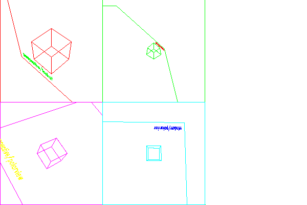

<?
<body>
  
  

    

      

      

      <h3><a name="0">NAME</a></h3>
      <blockquote>
        <b>window(3f)</b> - [M_draw:PROJECTION] Specify a perspective viewing pyramid <b></b>
      </blockquote>
      <h3><a name="4">SYNOPSIS</a></h3>
      <blockquote>
        <pre>
subroutine <b>window</b>(<i>left</i>, <i>right</i>, <i>bot</i>, <i>top</i>, <i>near</i>, <i>far</i>)
real <i>left</i>, <i>right</i>, <i>bot</i>, <i>top</i>, <i>near</i>, <i>far</i>
</pre>
      </blockquote>
      <h3><a name="2">DESCRIPTION</a></h3>
      <blockquote>
        
Specify a perspective viewing pyramid in world coordinates by giving the rectangle closest to the eye (ie. at the <i>near</i> clipping plane) and
        the distances to the <i>near</i> and <i>far</i> clipping planes.

      </blockquote>
      <h3><a name="3">EXAMPLE</a></h3>
      <blockquote>
        Sample program:
        <pre>
   program demo_windows
   use M_draw
   integer CUBE, TOPLEFT, TOPRIGHT, BOTTOMLEFT, BOTTOMRIGHT
   parameter(CUBE = 1, TOPLEFT = 2, TOPRIGHT = 3, BOTTOMLEFT = 4, BOTTOMRIGHT = 5)
   character(len=20) :: device
   print*,'Enter device name:'
   read(*,'(A)',iostat=ios)device
   if(ios.ne.0)device=' '
   call vinit(device)
   call pushviewport
   call textsize(0.5, 0.9)
   call font('futura.m')
   call color(D_BLACK)
   call clear
   ! make an object that represents the cube
   call makecube
   ! set up an object which draws in the top left of the screen.
   call makeobj(TOPLEFT)
   call viewport(-1.0, 0.0, 0.0, 1.0)
   call ortho2(-5.0, 5.0, -5.0, 5.0)
   call color(D_RED)
   call rect(-5.0, -5.0, 5.0, 5.0)
   call perspective(40.0, 1.0, 0.1, 1000.0)
   call lookat(5.0, 8.0, 5.0, 0.0, 0.0, 0.0, 0.0)
   ! Call an object within another object
   call callobj(CUBE)
   call color(D_GREEN)
   call move2(-4.5, -4.5)
   call drawstr('perspective/lookat')
   call closeobj
   ! now set up one which draws in the top right of the screen
   call makeobj(TOPRIGHT)
   call viewport(0.0, 1.0, 0.0, 1.0)
   call ortho2(-5.0, 5.0, -5.0, 5.0)
   call color(D_GREEN)
   call rect(-5.0, -5.0, 5.0, 5.0)
   call window(-5.0, 5.0, -5.0, 5.0, -5.0, 5.0)
   call lookat(5.0, 8.0, 5.0, 0.0, 0.0, 0.0, 0.0)
   call callobj(CUBE)
   call color(D_RED)
   call move2(-4.5, -4.5)
   call drawstr('window/lookat')
   call closeobj
   ! try the bottom left
   call makeobj(BOTTOMLEFT)
   call viewport(-1.0, 0.0, -1.0, 0.0)
   call ortho2(-5.0, 5.0, -5.0, 5.0)
   call color(D_MAGENTA)
   call rect(-5.0, -5.0, 5.0, 5.0)
   call perspective(40.0, 1.0, 0.1, 1000.0)
   call polarview(15.0, 30.0, 30.0, 30.0)
   call callobj(CUBE)
   call color(D_YELLOW)
   call move2(-4.5, -4.5)
   call drawstr('perspective/polarview')
   call closeobj
   ! and the bottom right
   call makeobj(BOTTOMRIGHT)
   call viewport(0.0, 1.0, -1.0, 0.0)
   call ortho2(-5.0, 5.0, -5.0, 5.0)
   call color(D_CYAN)
   call rect(-5.0, -5.0, 5.0, 5.0)
   call window(-5.0, 5.0, -5.0, 5.0, -5.0, 5.0)
   call polarview(8.0, -18.0, -3.0, 18.0)
   call callobj(CUBE)
   call color(D_BLUE)
   call move2(-4.5, -4.5)
   call drawstr('window/polarview')
   call closeobj
   ! now draw them
   call callobj(TOPLEFT)
   call callobj(TOPRIGHT)
   call callobj(BOTTOMLEFT)
   call callobj(BOTTOMRIGHT)
   idum=getkey()
   call vexit
   !=====================================================================
   contains
   !=====================================================================
   subroutine makecube
   ! set up a cube
   integer CUBE
   parameter (CUBE = 1)
   call makeobj(CUBE)
   ! The border around the cube
   call rect(-5.0, -5.0, 10.0, 10.0)
   ! Make the cube from 4 squares
   call pushmatrix()
   call side()
   call rotate(90.0, 'x')
   call side()
   call rotate(90.0, 'x')
   call side()
   call rotate(90.0, 'x')
   call side()
   call popmatrix()
   call closeobj()
   end subroutine makecube
   !=====================================================================
   subroutine side
   ! define a face for the cube
   call pushmatrix
   call translate(0.0, 0.0, 1.0)
   call rect(-1.0, -1.0, 1.0, 1.0)
   call popmatrix
   end subroutine side
   !=====================================================================
   end program demo_windows
 
</pre>
      </blockquote>
      

       
      

    

  

</body>
